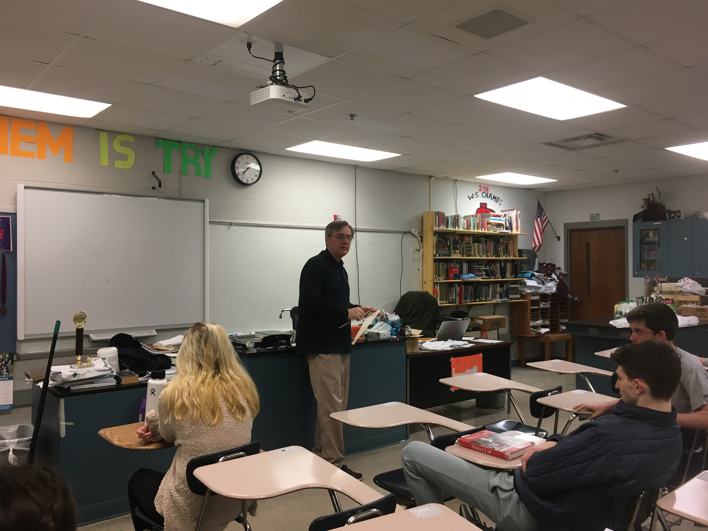
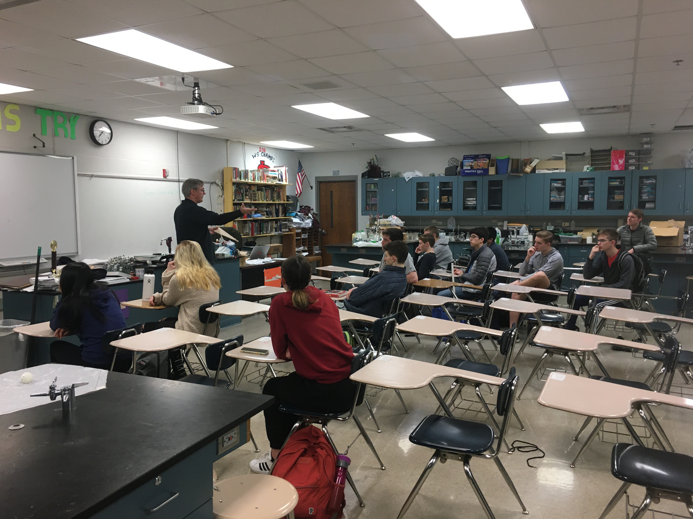
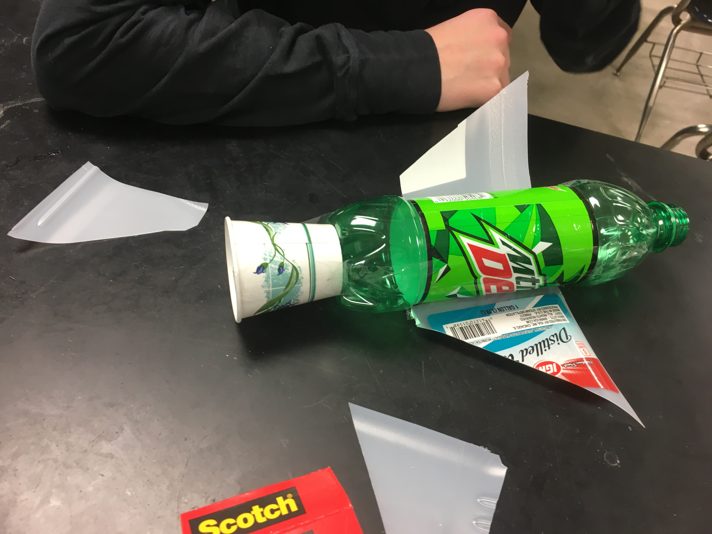
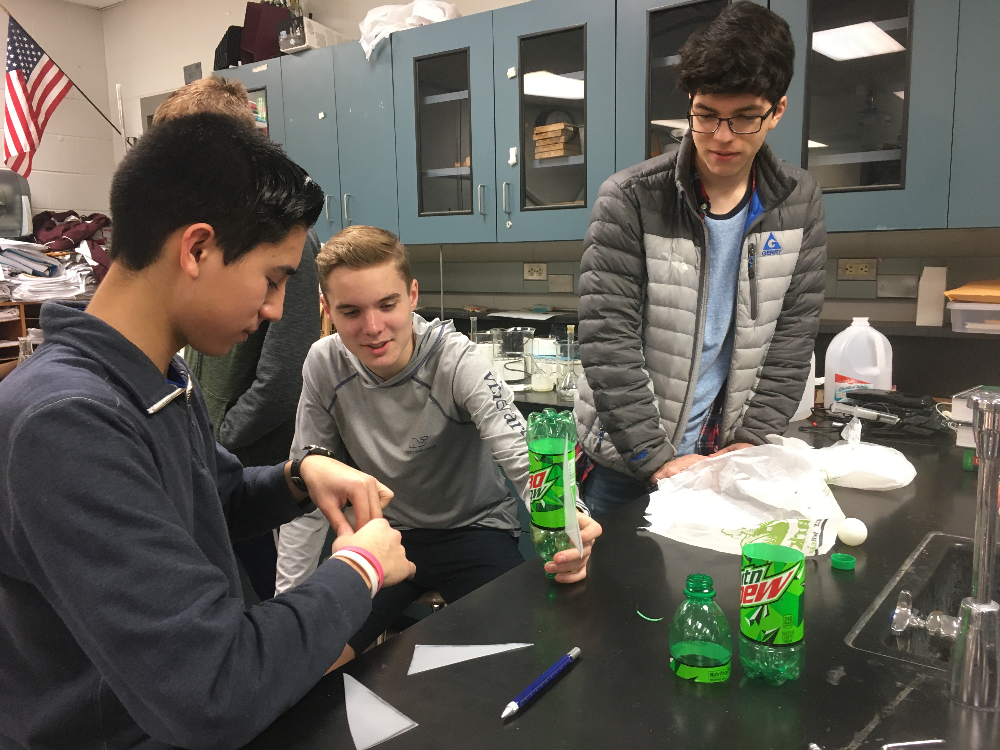
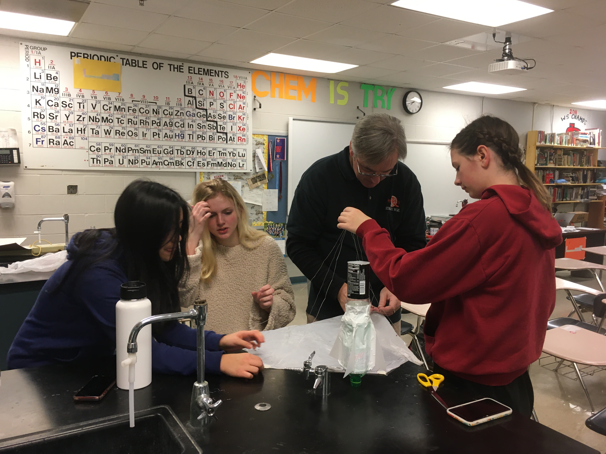
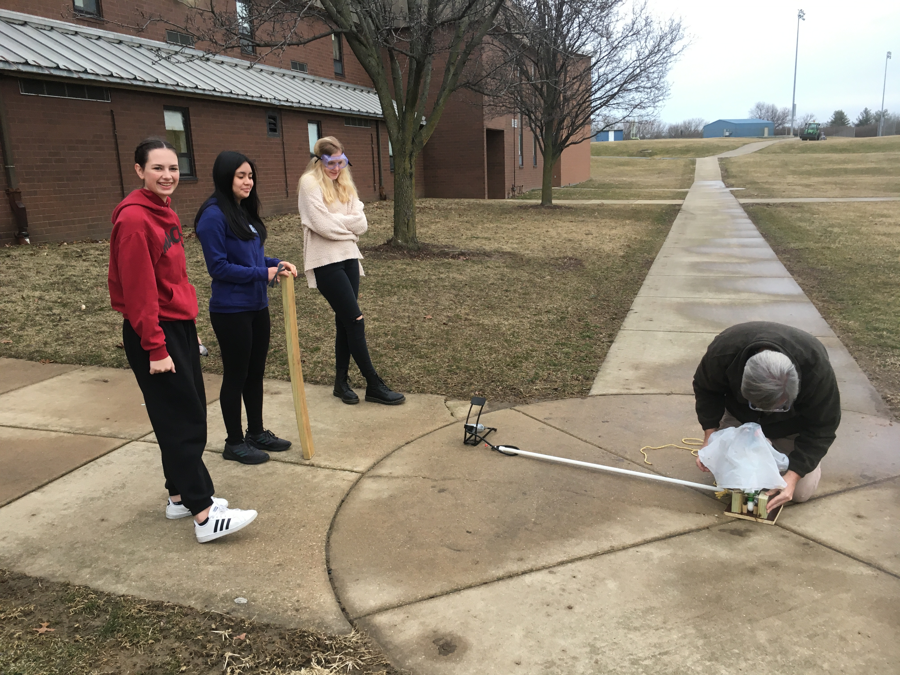
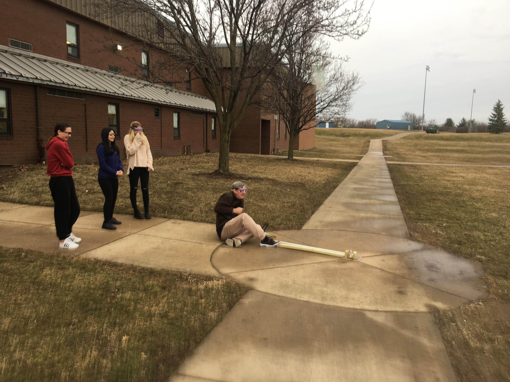

**The Mahomet-Seymour High School STEM Club provides opportunities for students to participate and lead STEM projects each meeting.** 

## **STEM Club Week 23 Project**

  

# **Bottle Rocket Project and Launch Day 2**

Project lead - Mr. Koker

                                                                                      

This project students worked into groups of their choosing.  Each group was given various supplies to create a bottle to launch with air pressure.  

 

 

 

 

 

 

 

 
