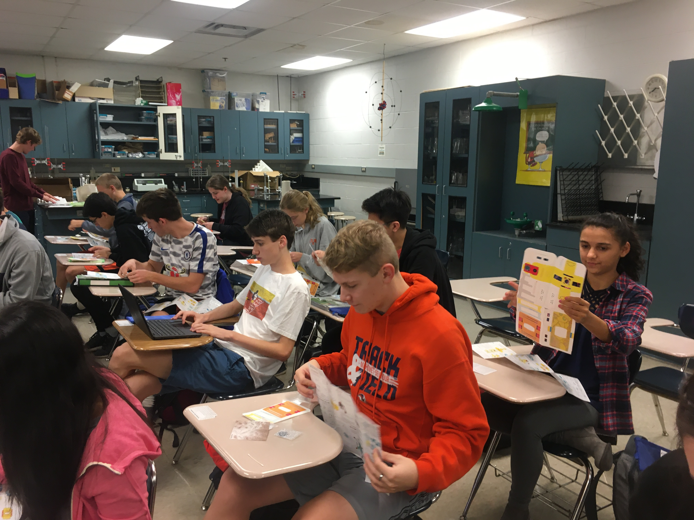

**The Mahomet-Seymour High School STEM Club provides opportunities for students to participate and lead STEM projects each meeting.** 

## **STEM Club Week 7 Project**

# **Building a Microscope**

Project lead - Mr. Walmer and Mr. Koker

This project students worked independently and together to build a microscope.             
                                                                                         
                                                                                                     
                                                                                                           
                                                                                                                
                                                                    

