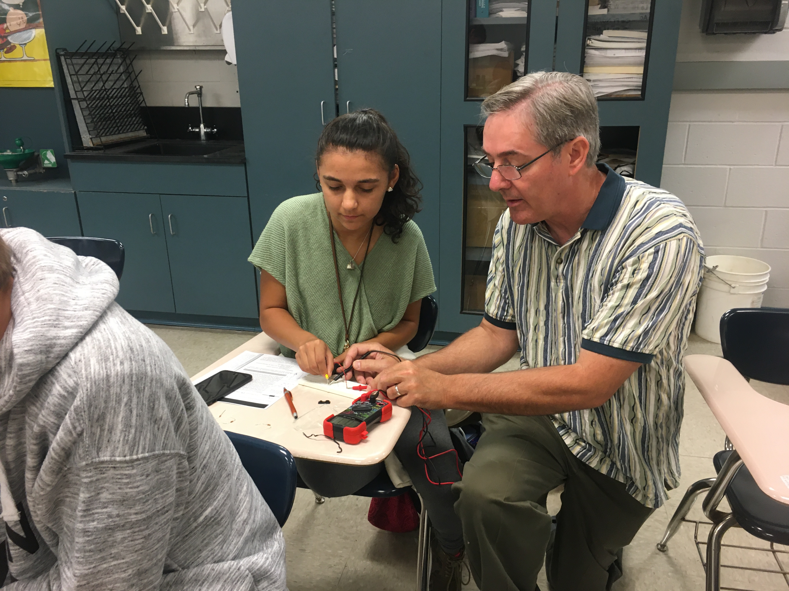
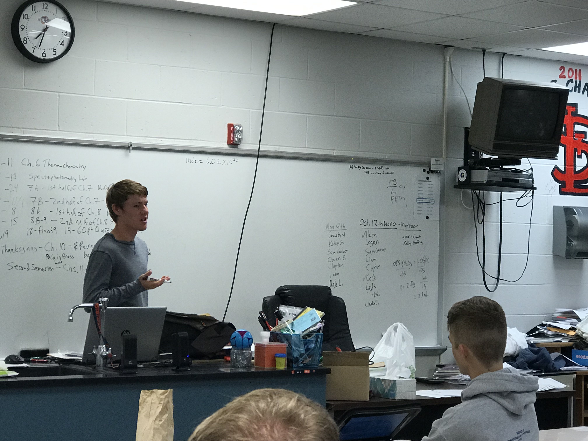

**The Mahomet-Seymour High School STEM Club provides opportunities for students to participate and lead STEM projects each meeting.** 

## **STEM Club Week 6 Project**

# **Building a resistor to provide light from an LED**

Project lead - Mr. Walmer

This project students worked together to build a resistor to provide maximum light output from an LED while maintaing safe current.      

Students were given a quick lesson on Ohms, volts, and amps.                                   

Volts = Amperes x Ohms                                        

Kirchoff's Law (KVL): Voltage dropped in closed loop is zero, energy conservation.                              

Current Law (KCL): Current flowing into junction point equals current flowing out, charge conservation.                   

Students used probe cables, a Protoboard, resistors, LED, battery clips.                    
                                                                                         
                                                                                                     
                                                                                                           
                                                                                                                
                                                                    

