**The Mahomet-Seymour High School STEM Club provides opportunities for students to participate and lead STEM projects each meeting.**

## **STEM Club Week 10 Project**

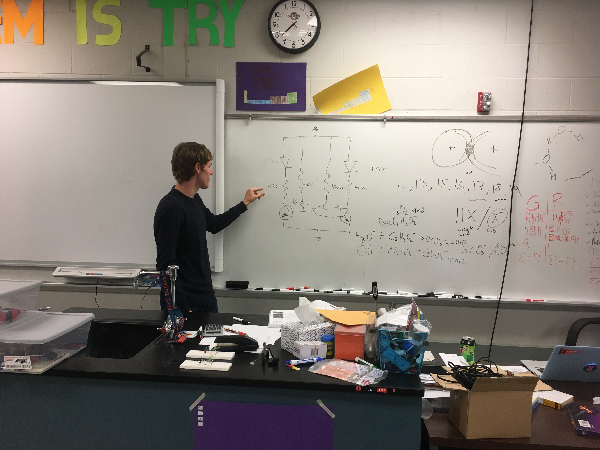  

# **Building Transistor Circuits Part 2**

Project lead - Mr. Walmer

This project students worked together or independently to build transistor circuits.
Each group of students were given a kit with a bread board, capacitors, resistors, transistors, a battery pack, and LED.
Students tried a different project with circuits in the second week in this activity.

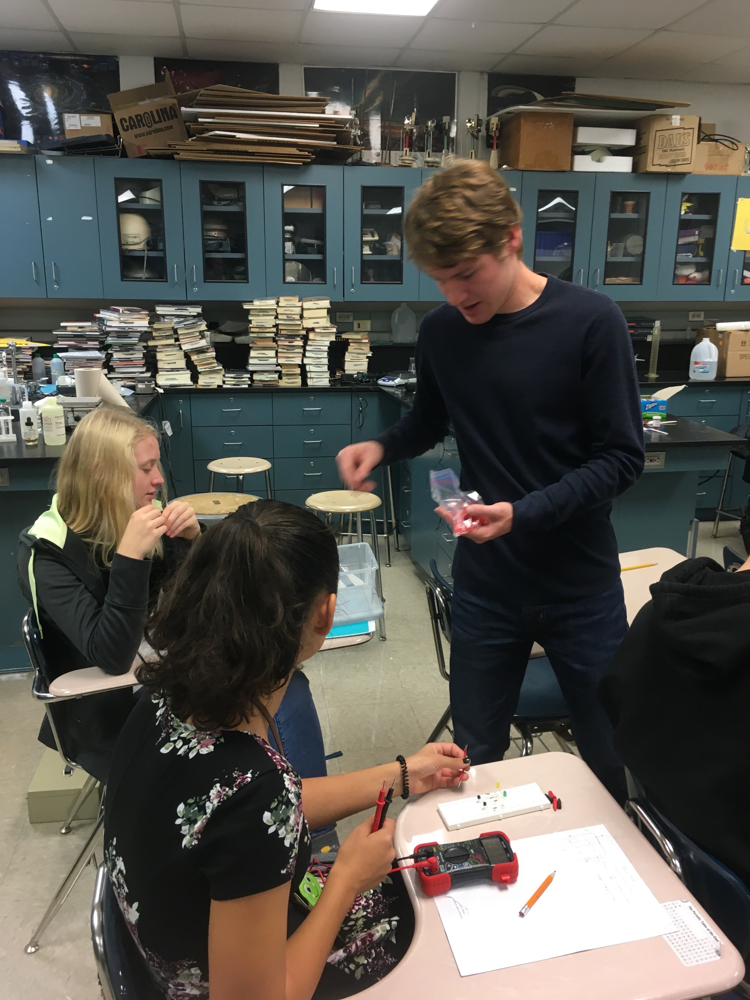

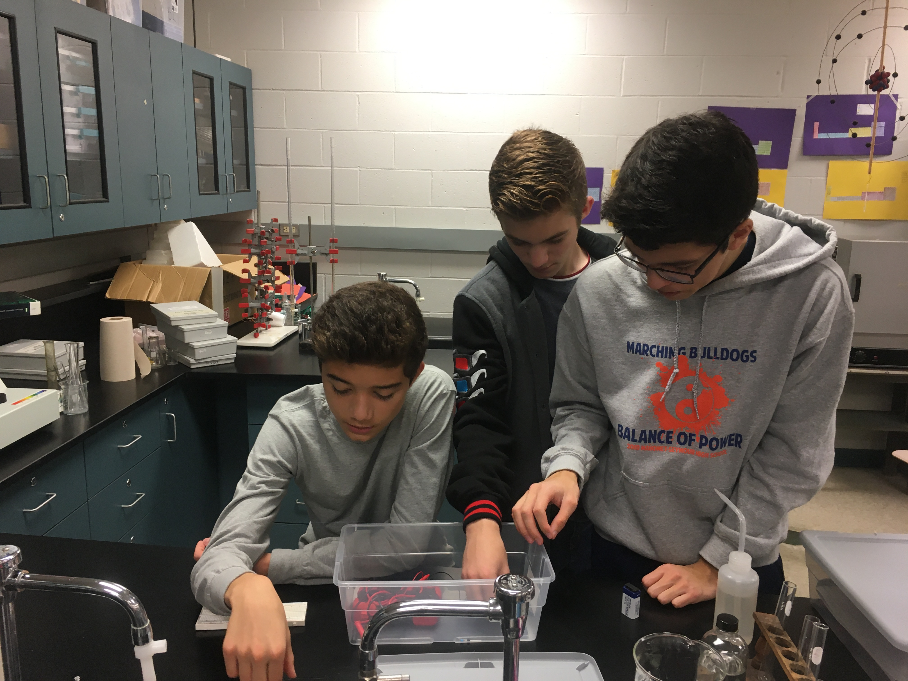

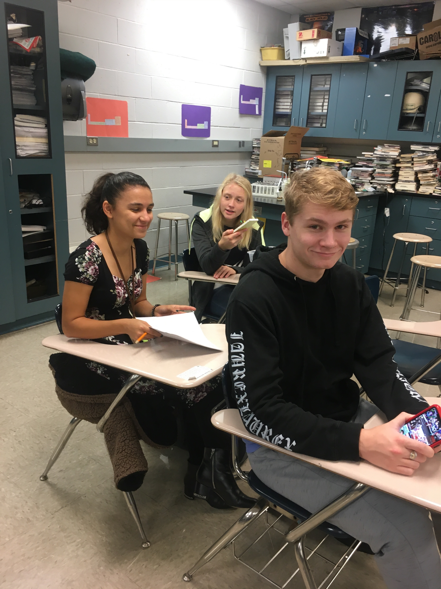

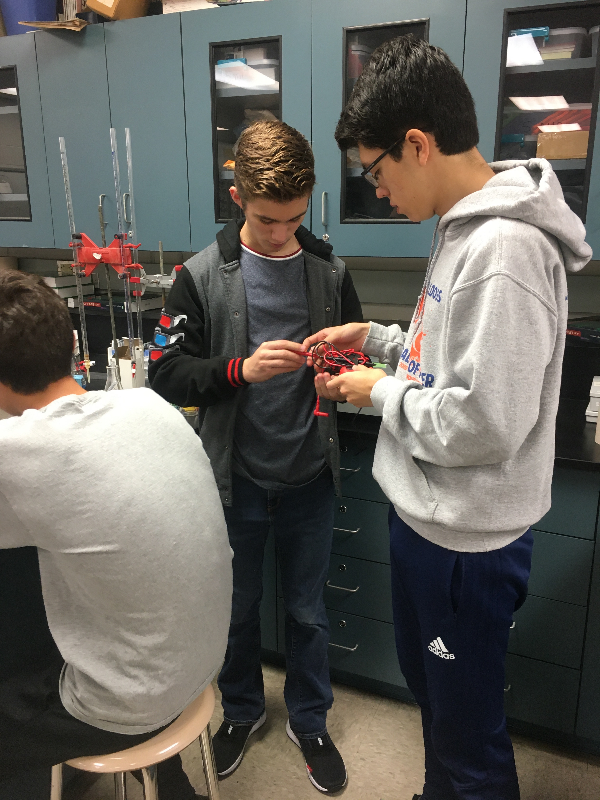                                                                    

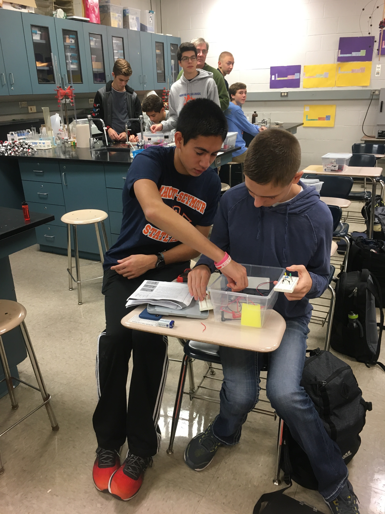

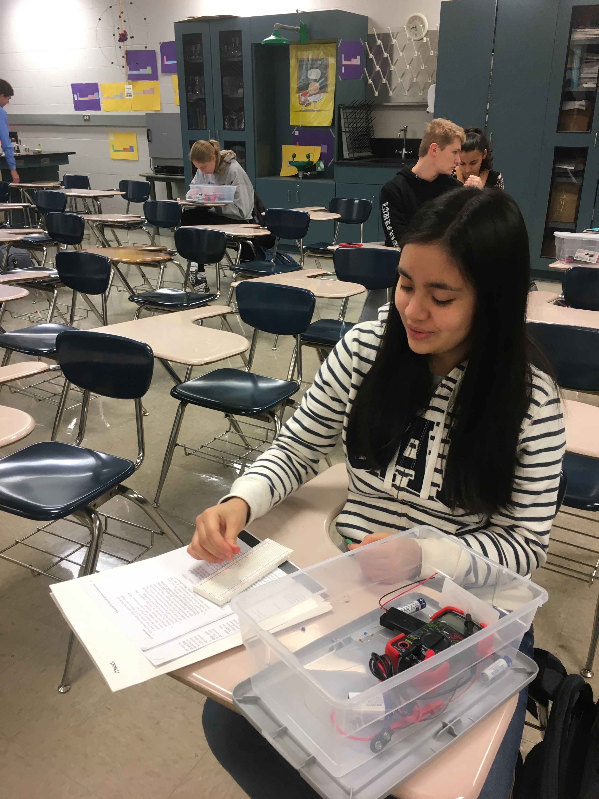

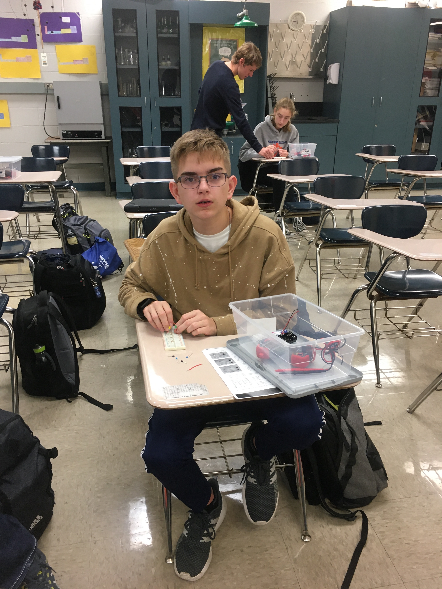

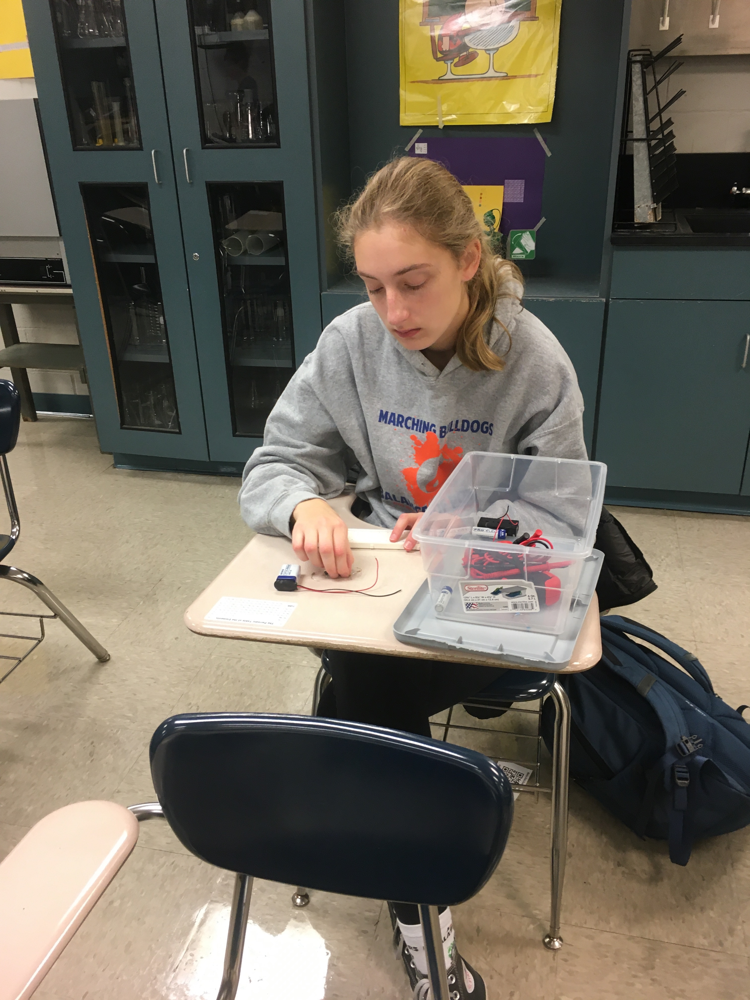                                                                    

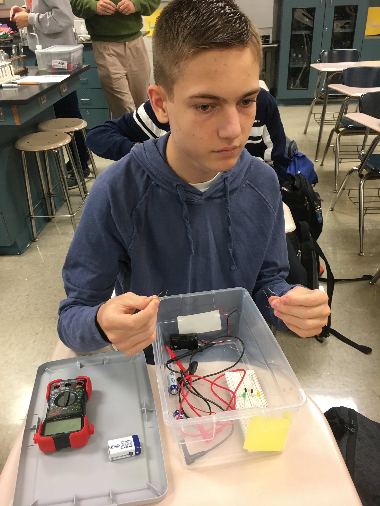

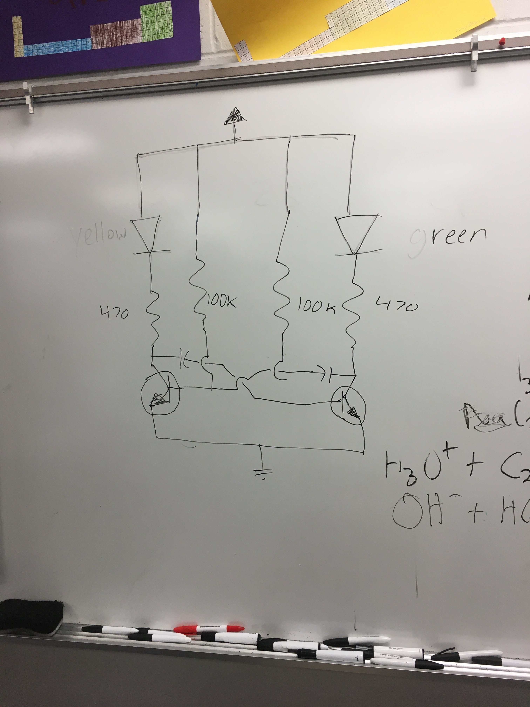

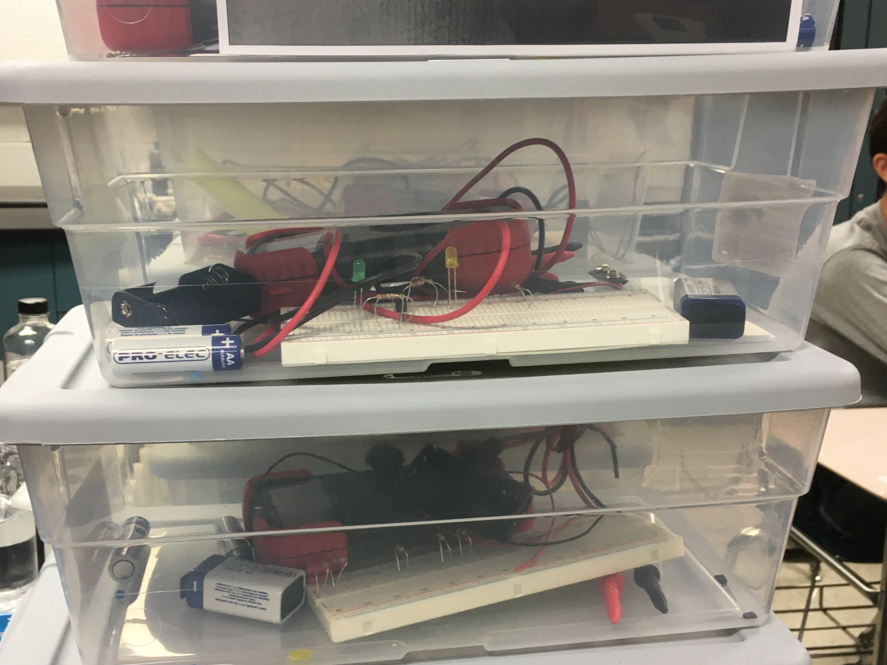

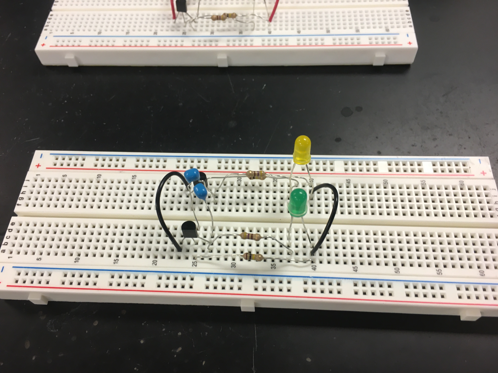                                                                    

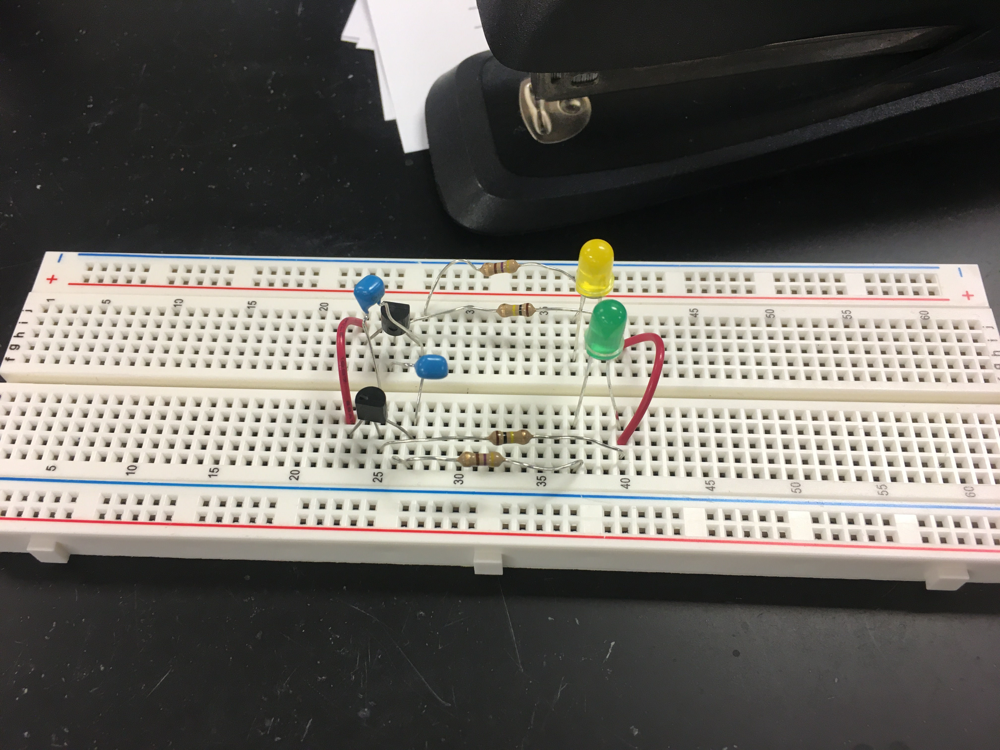
