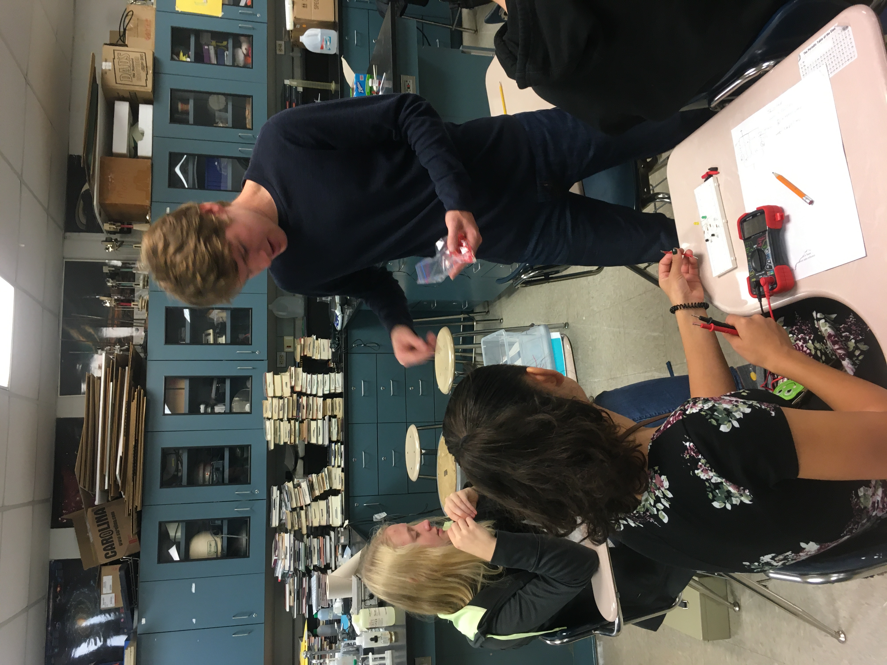
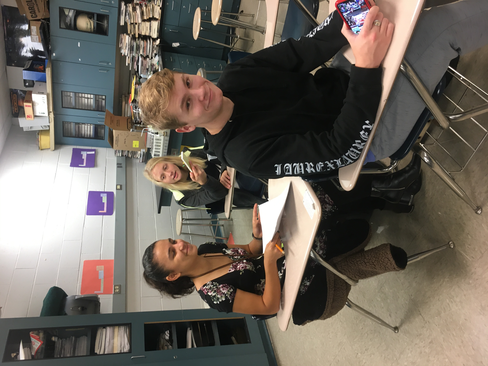
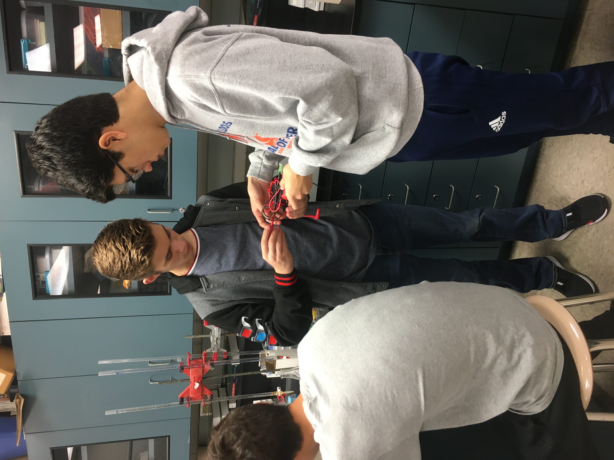
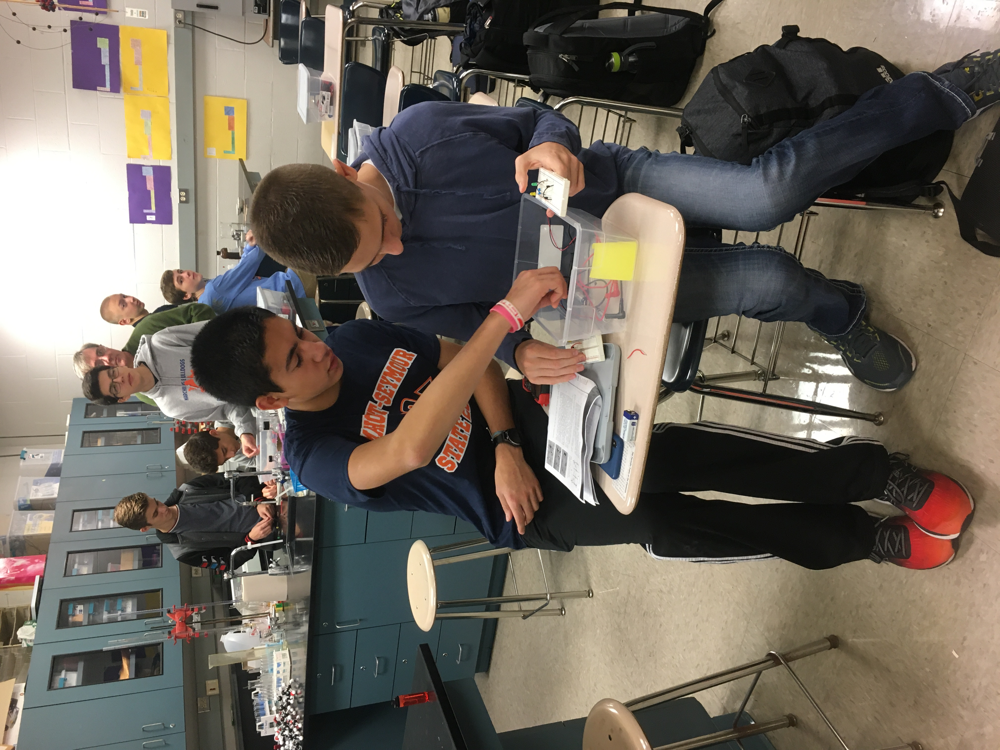
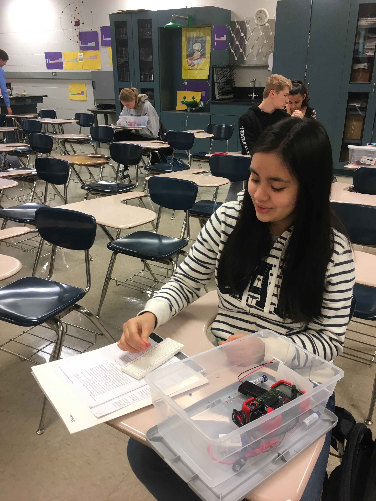
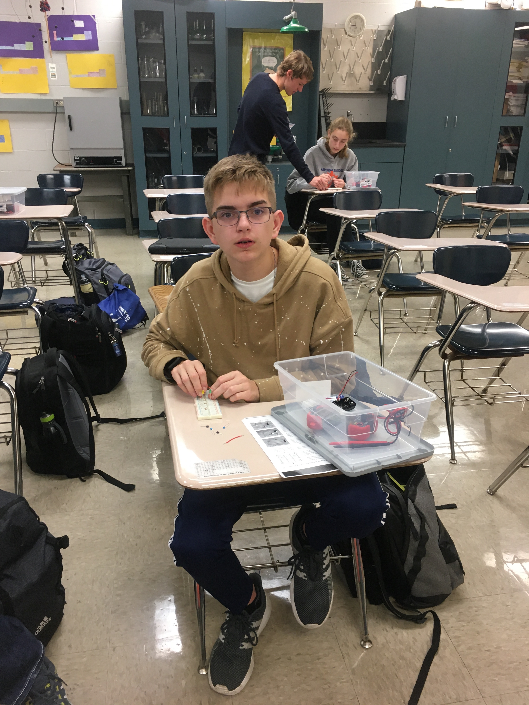
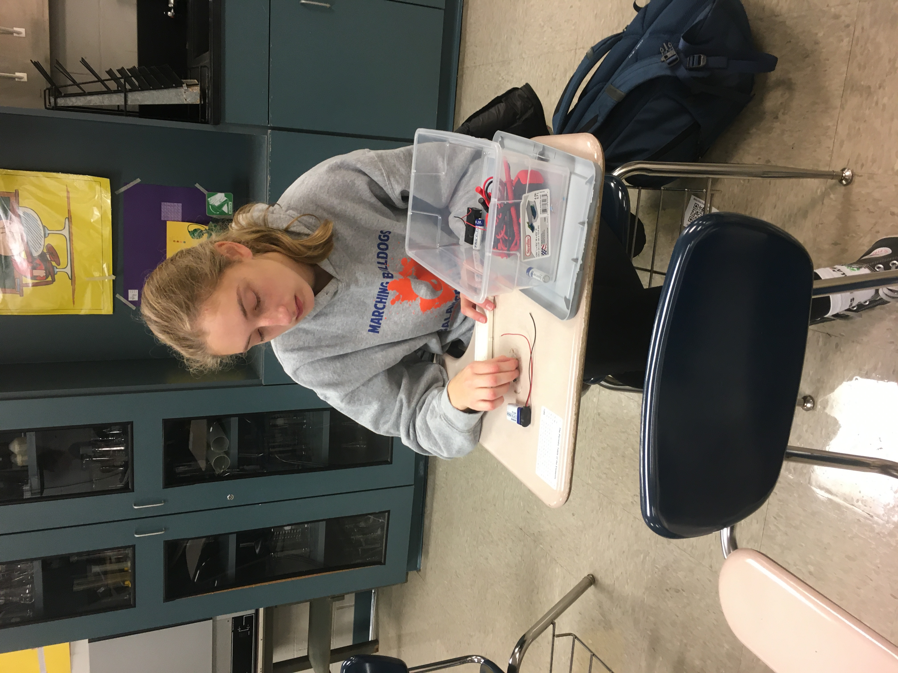
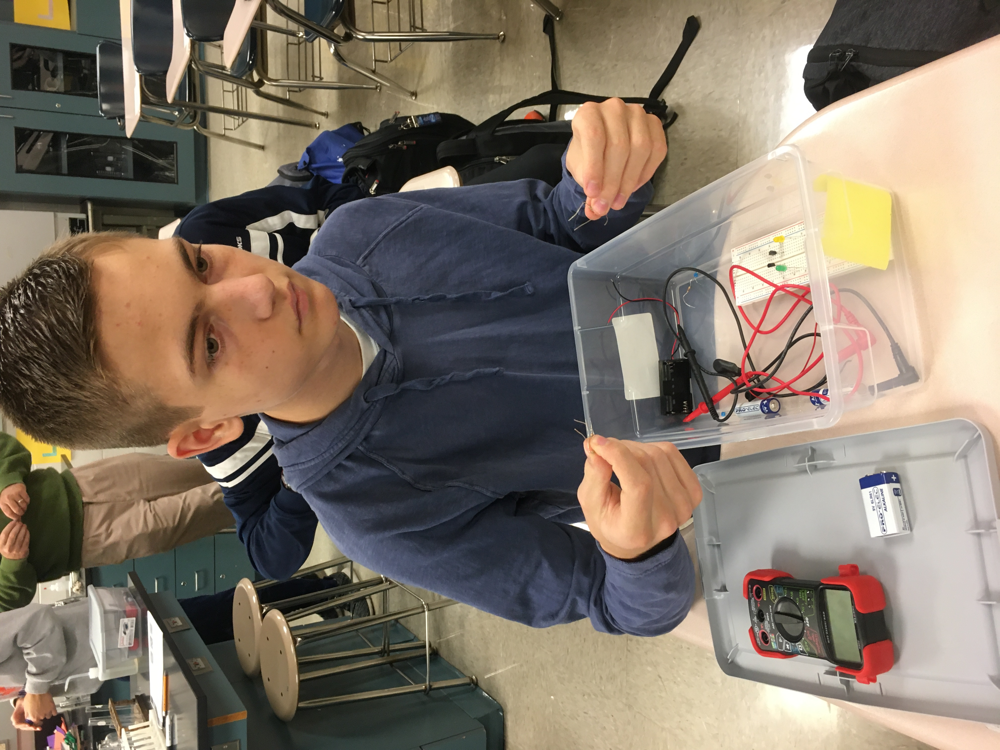
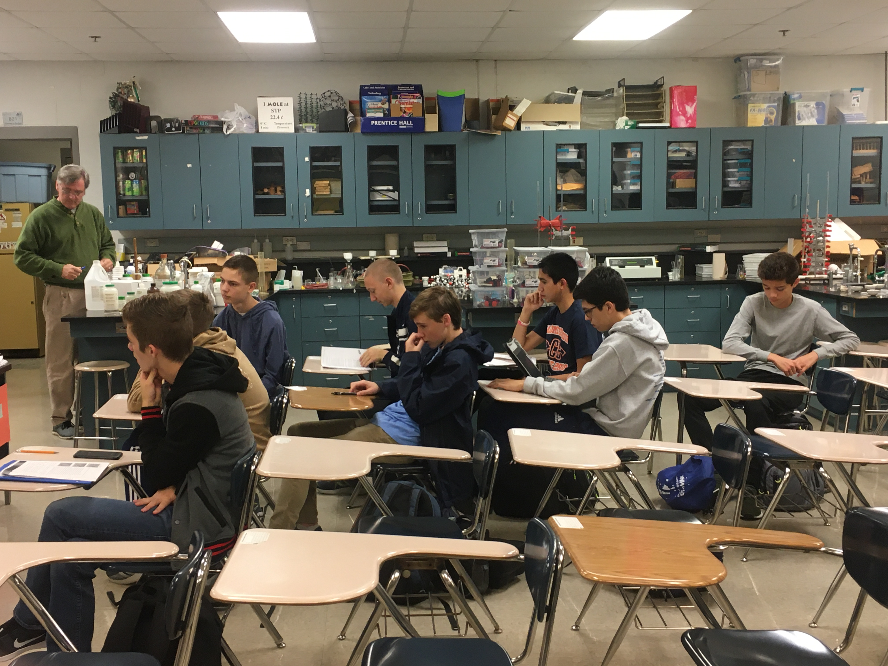
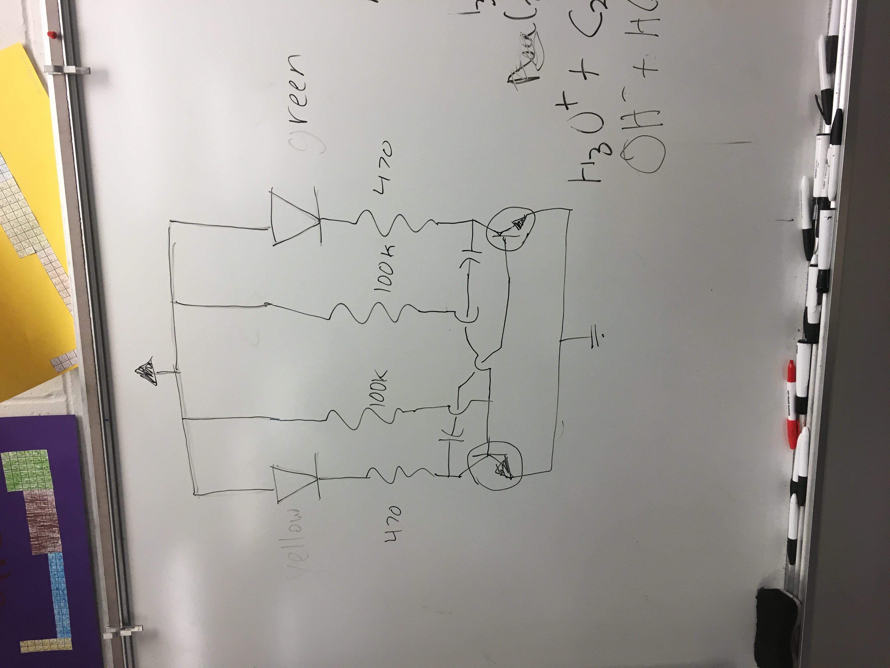

**The Mahomet-Seymour High School STEM Club provides opportunities for students to participate and lead STEM projects each meeting.** 

## **STEM Club Week 10 Project**

  

# **Building Transitor Circuits Part 2**

Project lead - Mr. Walmer

                                                                                      

This project students worked together to build transitor circuits. 
Each group of students wer given a kit with a bread board, capacitors, resistors, transistors, a battery pack, and LED.
Students tried a different project with circuits in the second week in this activity.
                                                                                         

                                                                    

                                                                    

                                                                    

