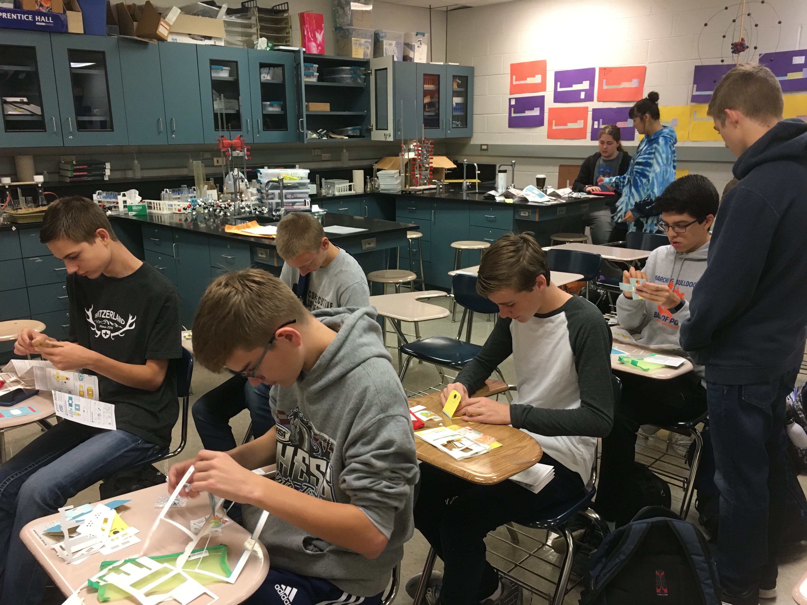

**The Mahomet-Seymour High School STEM Club provides opportunities for students to participate and lead STEM projects each meeting.** 

## **STEM Club Week 8 Project**

# **Building a Microscope Day 2**

Project lead - Mr. Walmer and Mr. Koker

                                                                                      

This project students worked independently and together to build a microscope. 
Each student was given a kit with a microscope they built by folding pieces of thick paper and adding lenses.
                                                                                         
                                                                                                    
                                                                                                         
                                                                                                                
                                                                    

