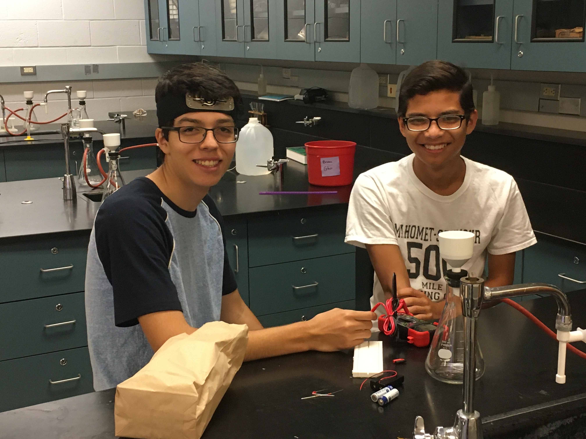
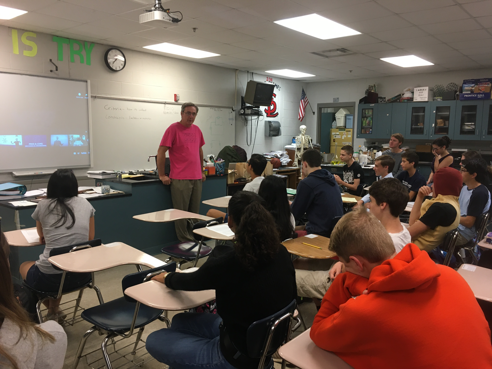
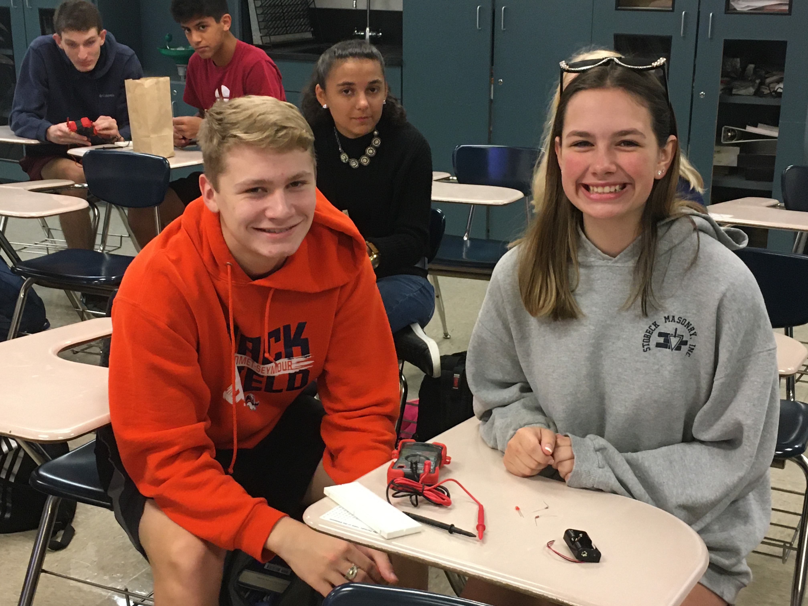
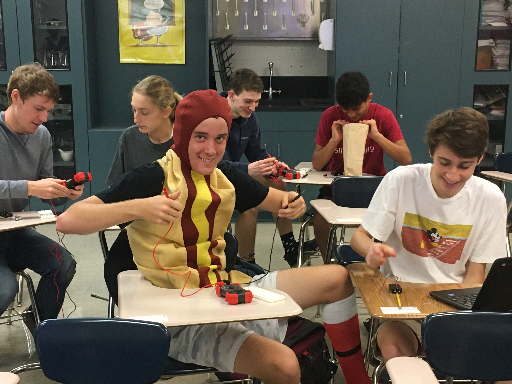
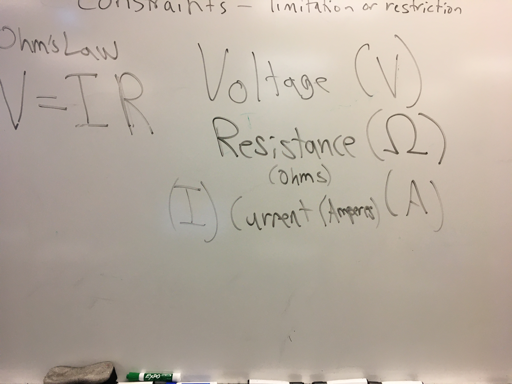
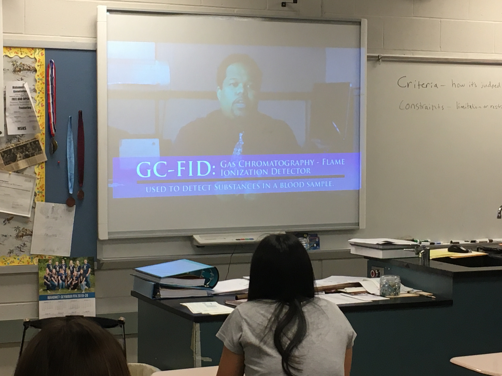
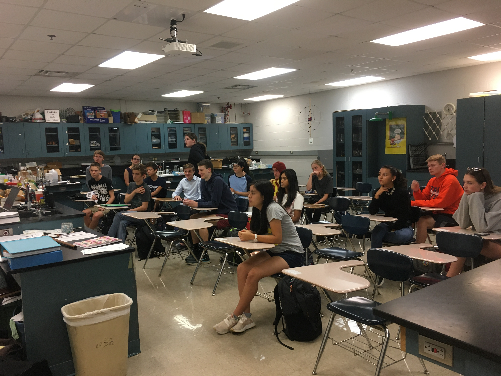
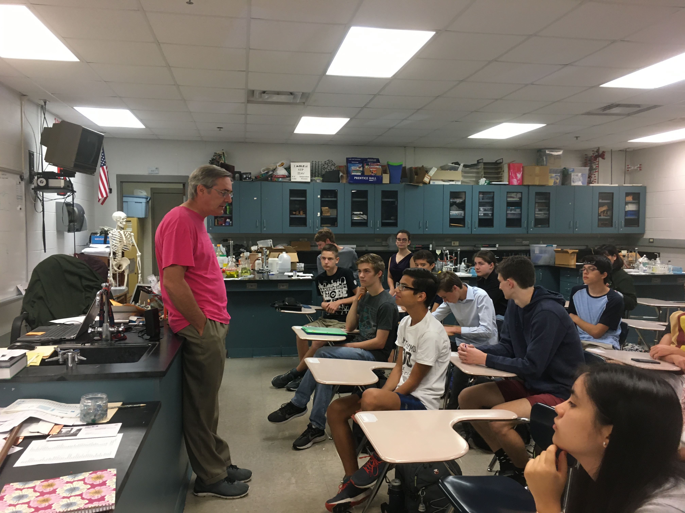

**The Mahomet-Seymour High School STEM Club provides opportunities for students to participate and lead STEM projects each meeting.** 

## **STEM Club Week 4 Project**

# **Circuits and Using Digital Multimeters Activity**
Project lead - Mr. Koker

**The Circuits and Using Digital Multimeters Activity provides a hands on opportunity to learn about using digital multimeters.**

Each STEMclub member will get a red circuit board and learn about which circles are connected.

Members learned how resistance works in series, additive, and in parallel, 1/Rtotal = 1/R1 + 1/R2.

Each STEMclub member will then use 2 AA battery packs and batteries, and an LED to make a simple circuit to light the LED.

