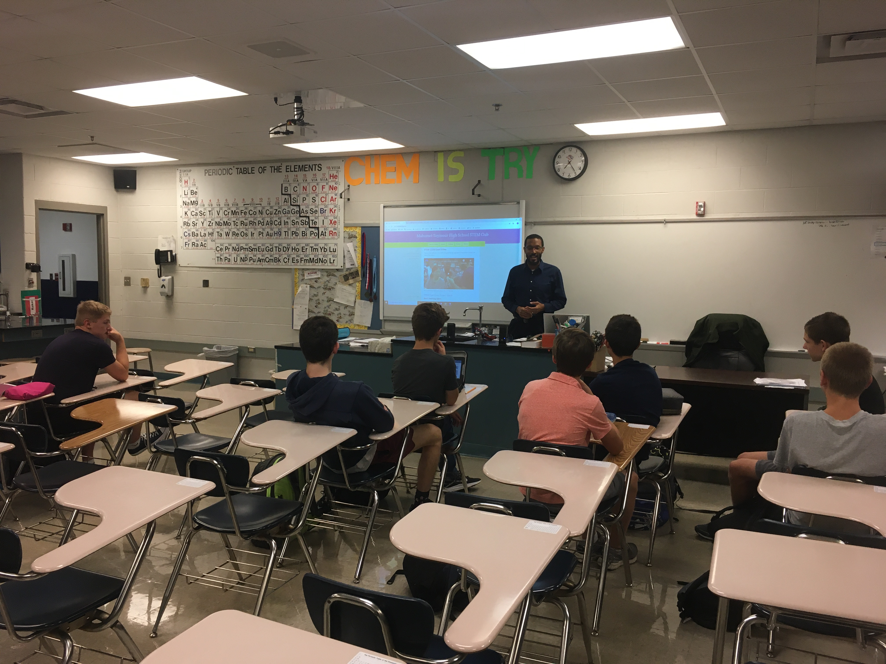
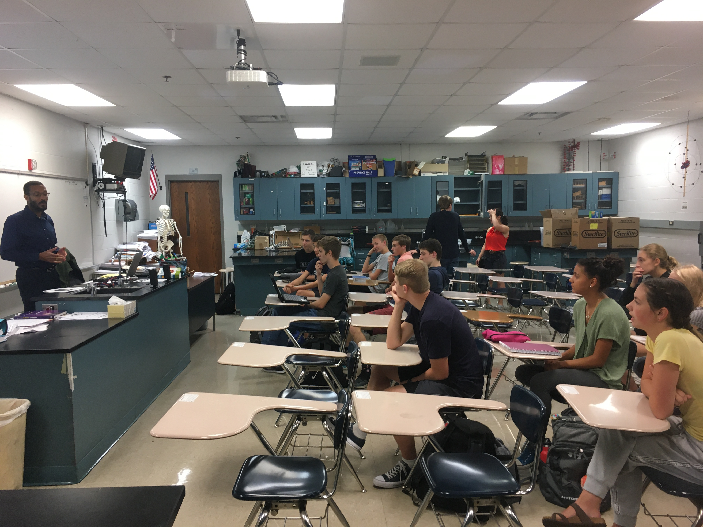

**The Mahomet-Seymour High School STEM Club provides opportunities for students to participate and lead STEM projects each meeting.** 

## **STEM Club Week 3 Project**

# **Exploring Experimental Design Activity**
Project leader - Mr. Walmer

**The Exploring Experimental Design activity provides a hands on opportunity to learn about the different aspects of how a good experiment is designed.**

STEM club members were divided into groups of two.
STEM club groups were given a bag with different supplies.
Each bag contained a battery holder with red and black probes, battery, 1 LED, 1 resister, and 2 alligator clicks.  
Some bags had two batteries and some just had one.

STEM club members then attempted to wire a configuration that would hopefully lead to a LED lighting up.  

The different groups got different results based off the supplies they were given in their bags.  
The smaller groups merged into mid-sized groups in order to discuss how each of their experiments worked and to discuss the differences in both the set ups and results of their experiments.  In doing so they could discover the different design elements that led to specific results.

The mid-sized groups met into one large group to finally discuss the benefits of a good experimental design.

# **Learning about the STEM Club grant from Dr. Lynford Goddard**

Dr. Lynford Goddard scents years of hard work to write a grant to get the funding needed to create STEM clubs and STEM camps for Illinois high school students.  He wrote a book with detailed STEM club experiments that we will be using for our projects.  He also provided our school STEM club kits with various activities for our club members to use. Without his years of hard work our STEM club wouldn't have been created.

