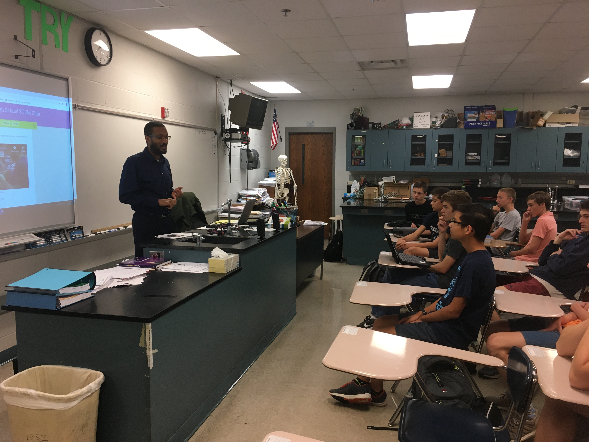
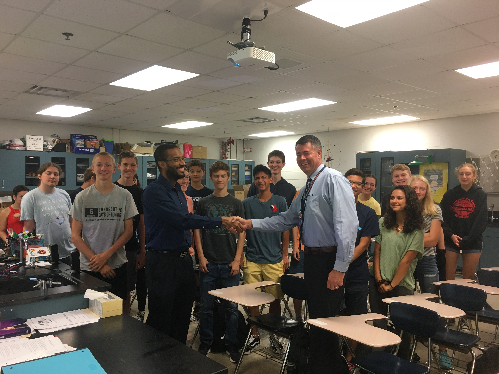
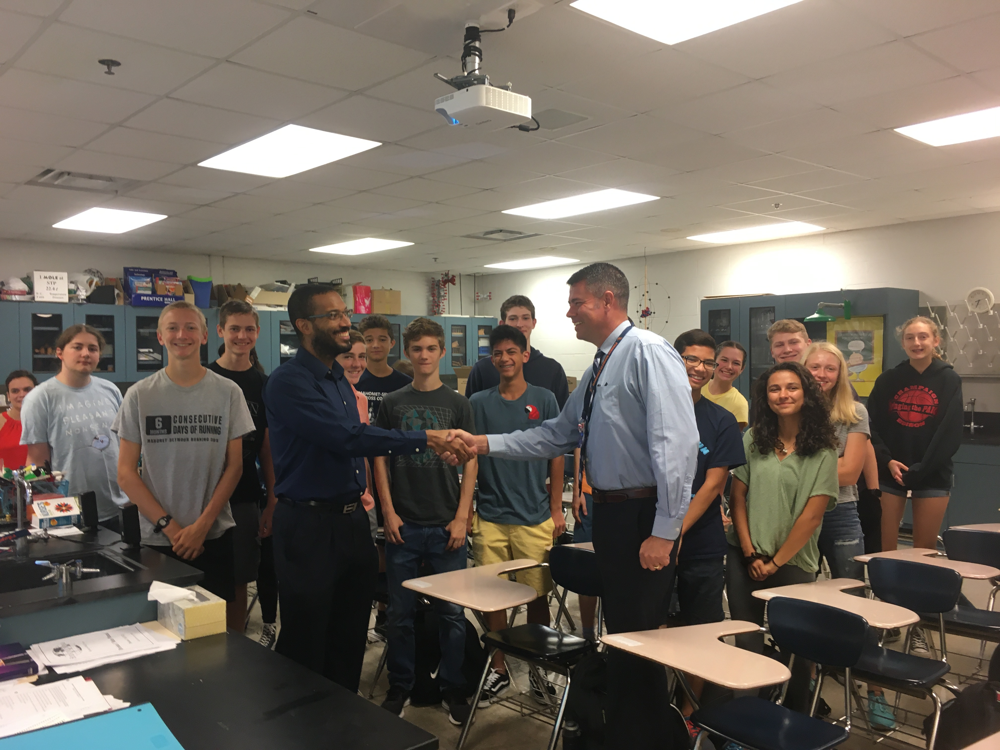
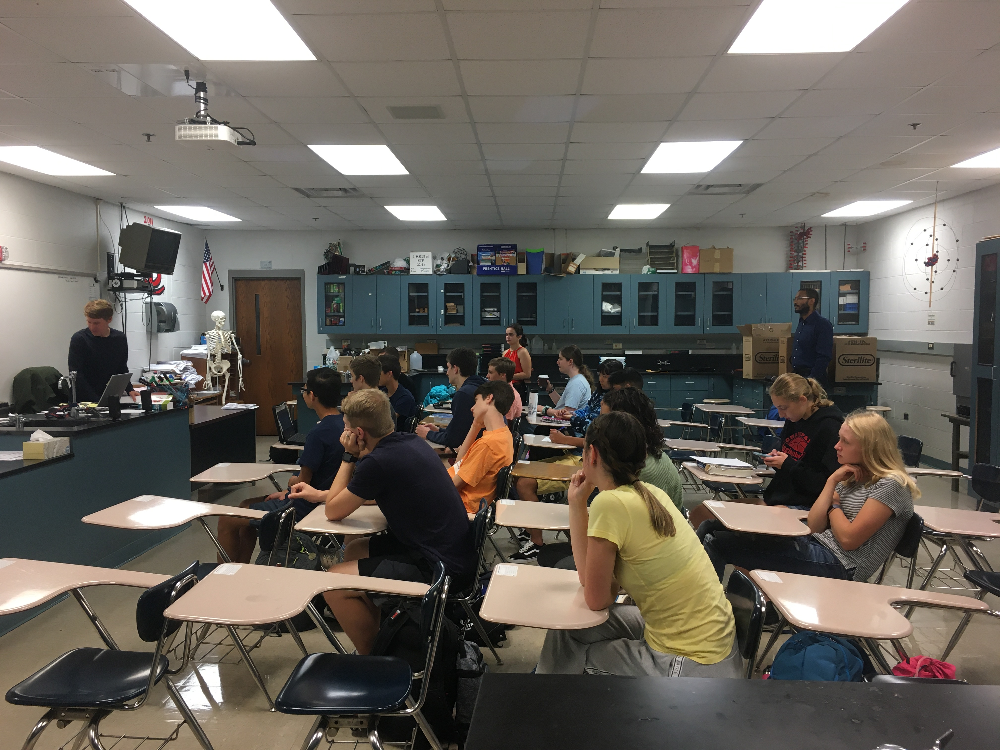

**The Mahomet-Seymour High School STEM Club provides opportunities for students to participate and lead STEM projects each meeting.** 

## **STEM Club Week 3 Project**

# **LED/resister/battery Experiment Grab Bag**
Project leader - Mr. Walmer

**The --- provides a hands on opportunity to learn about --**

