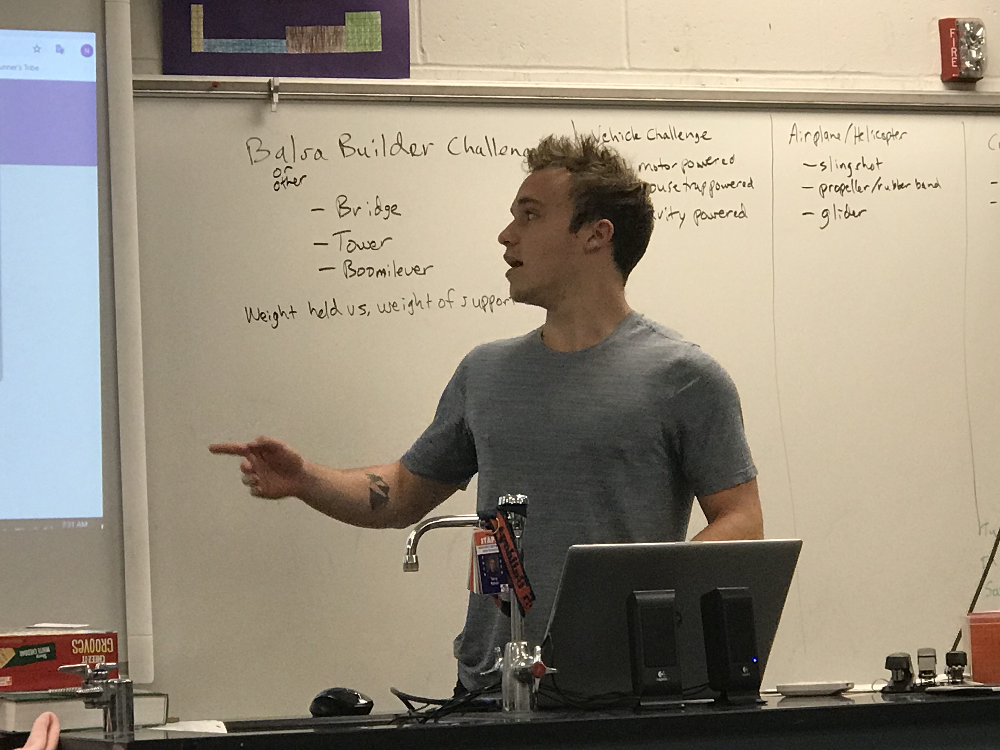
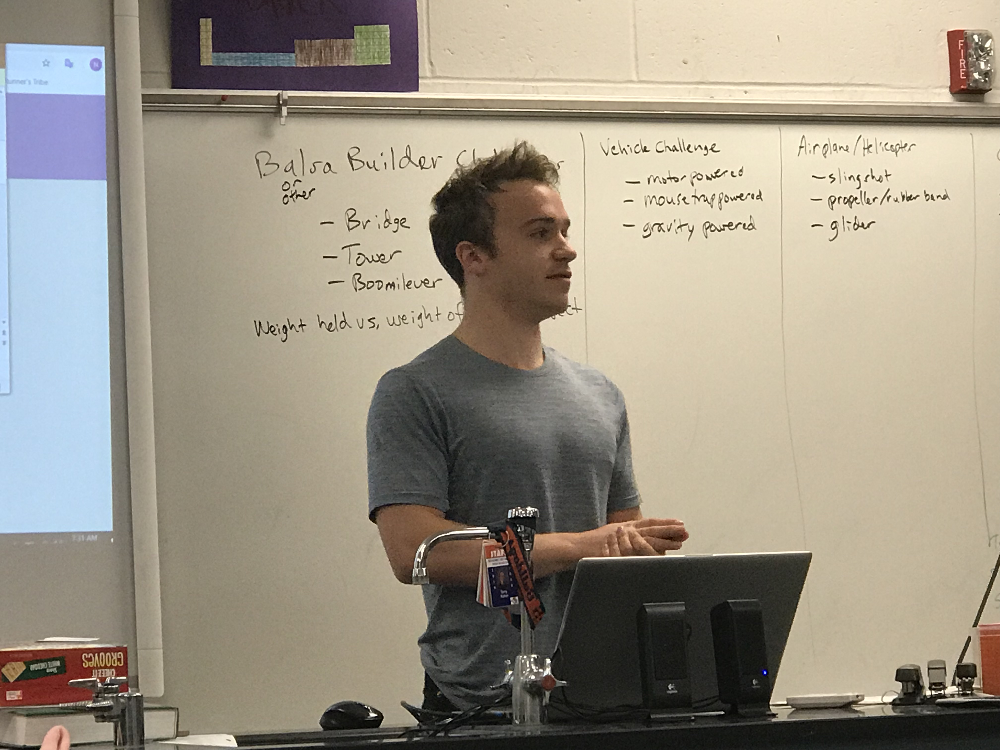
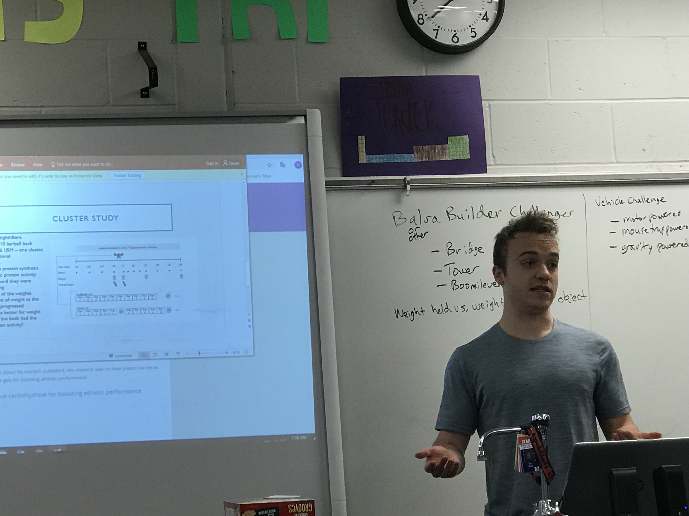
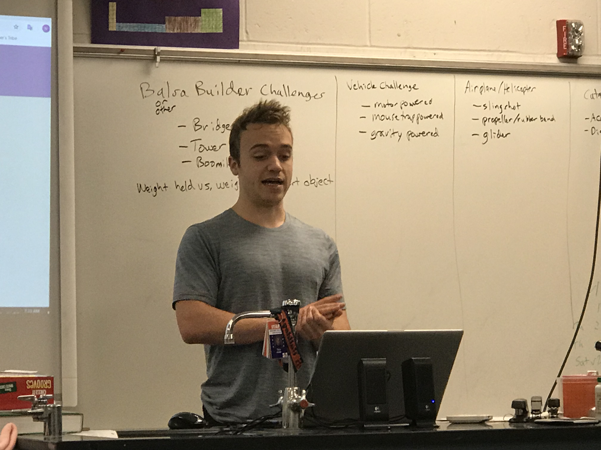
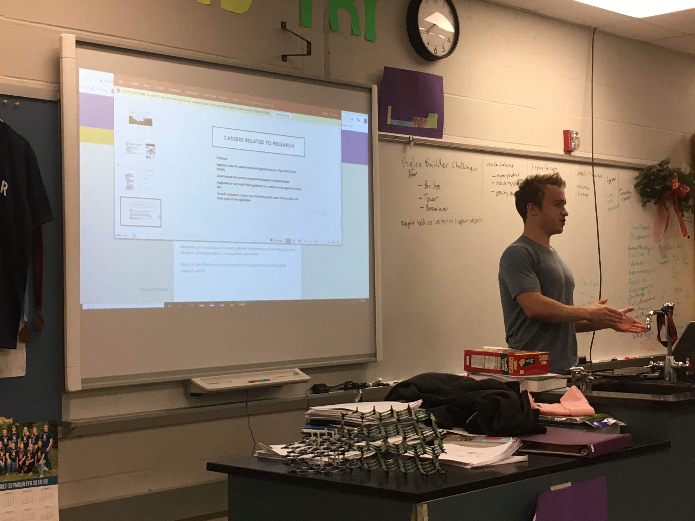
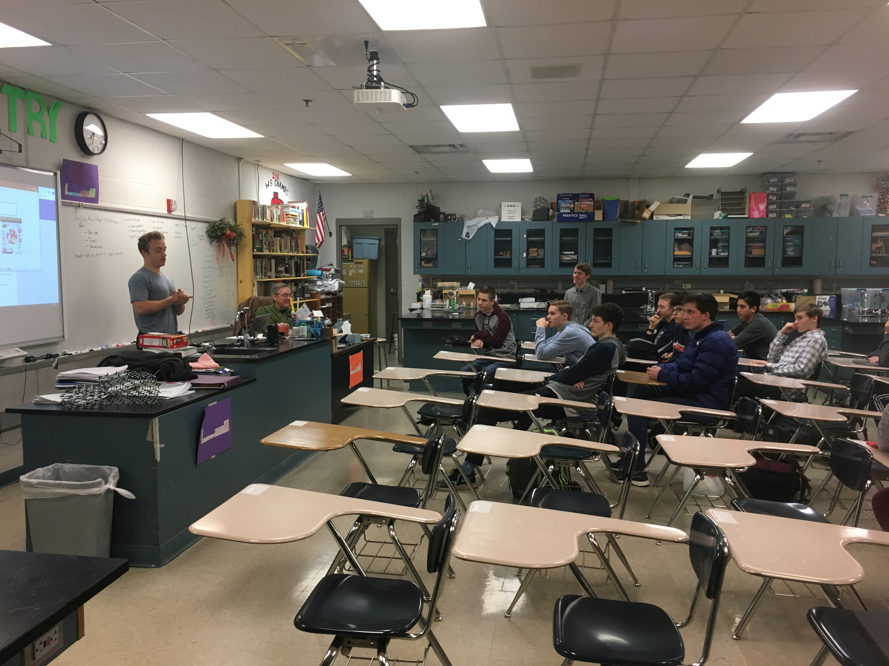

**The Mahomet-Seymour High School STEM Club provides opportunities for students to participate and lead STEM projects each meeting.**

## **STEM Club Week 17 Career Speaker**

# **Introduction into kinesiology and molecular biology**
Career Speaker - Alex Keeble

# **Learning about kinesiology and molecular biology from Alex Keeble**                               

Alex Keeble is pursuing degrees in kinesiology and molecular biology at the University of Illinois.  He helped introduce our STEM Club to his research project.  Alex also talked to our club about kinesiology and molecular biology.

## **[Powerpoint of Alex's presentation](/documents/AlexKeebleSTEM..pptx)**

Alex Keeble got an article about his research published.  His research was on how potato can be as effective as carbohydrate gels for boosting athletic performance.                                                                                        
### **[Potato as an effective carbohydrate for boosting athletic performance research article](https://news.illinois.edu/view/6367/803645)**

