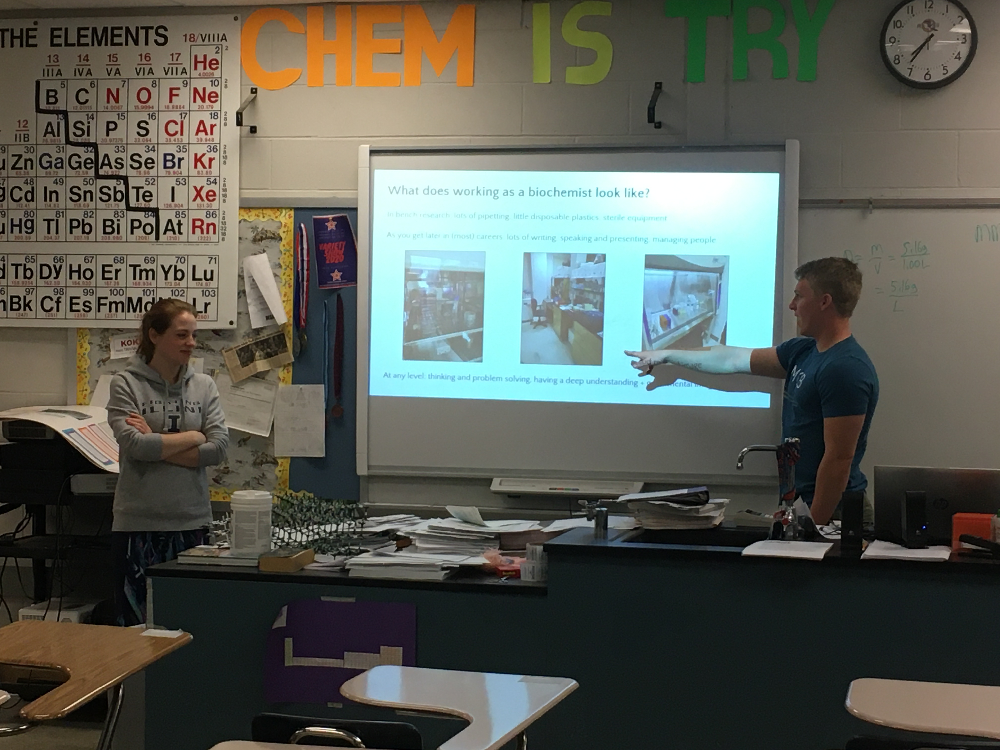
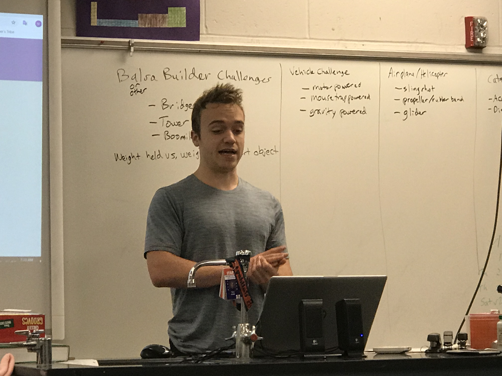
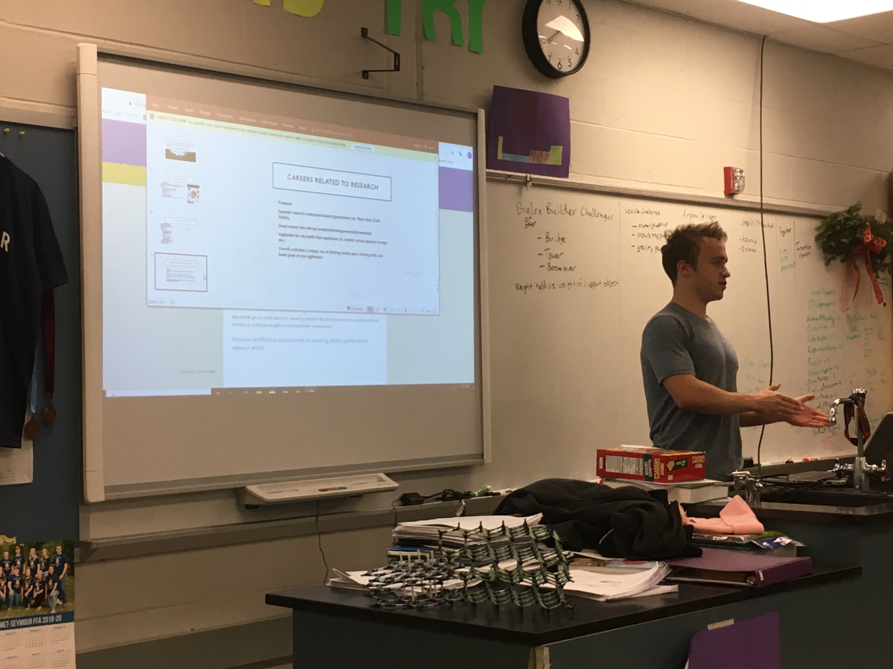

**The Mahomet-Seymour High School STEM Club provides opportunities for students to participate and lead STEM projects each meeting.**

## **STEM Club Week 22 Career Speaker**

# **Introduction into Biology and BioChemistry majors and careers**
Career Speaker - Max Baymiller and Rachel Martini

# **Learning about biochemistry and biology from Max Baymiller and Rachel Martini**                               

Max and Rachel are grad students pursuing their PHDs at the University of Illinois.  
They helped introduce our STEM Club to the education and careers in the biochemistry fields.  
Rachel and Max talked about their own experiences and gave great advice on college admissions, research, and grad school.

Alex Keeble got an article about his research published.  His research was on how potato can be as effective as carbohydrate gels for boosting athletic performance.                                                                                        
### **[Potato as an effective carbohydrate for boosting athletic performance research article](https://news.illinois.edu/view/6367/803645)**

