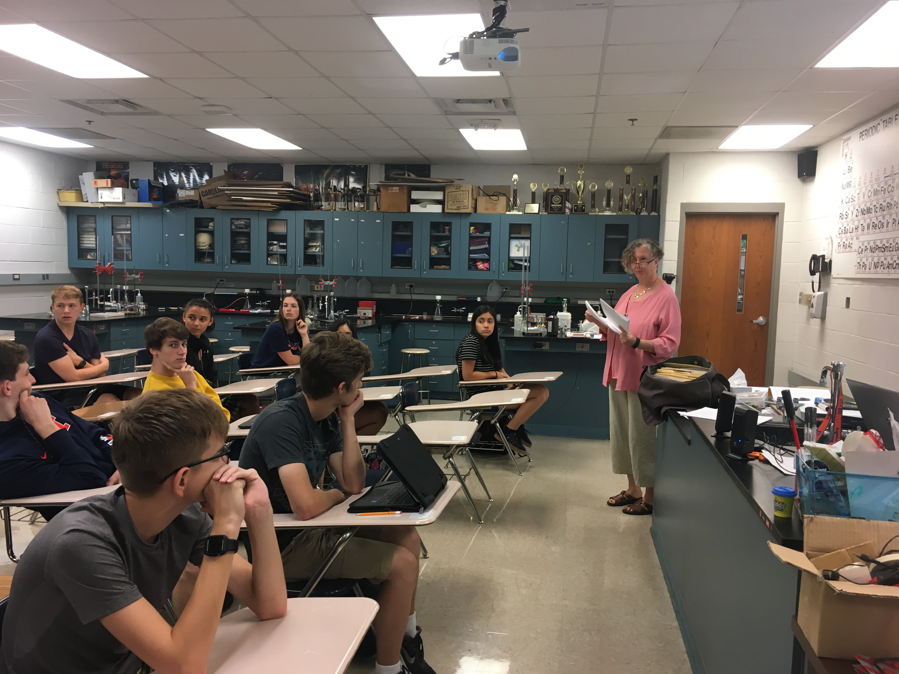
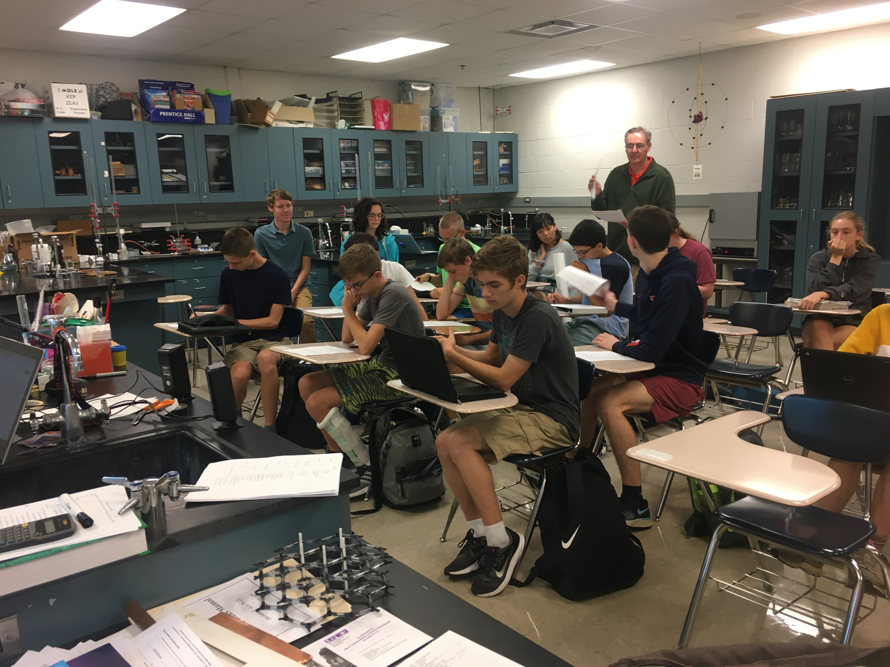
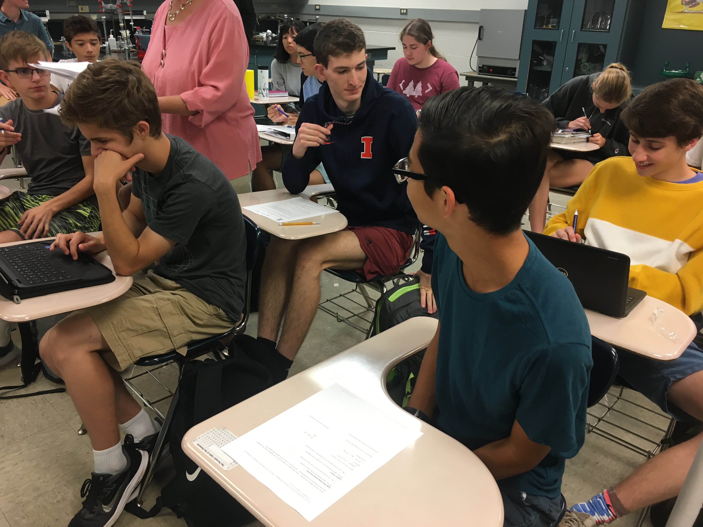
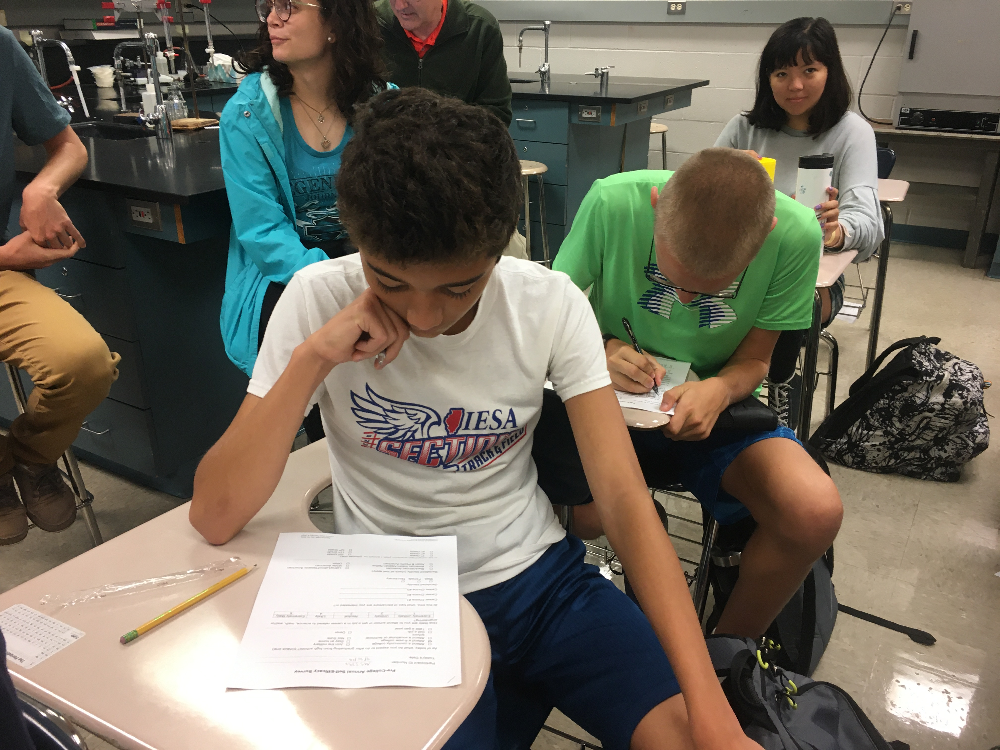
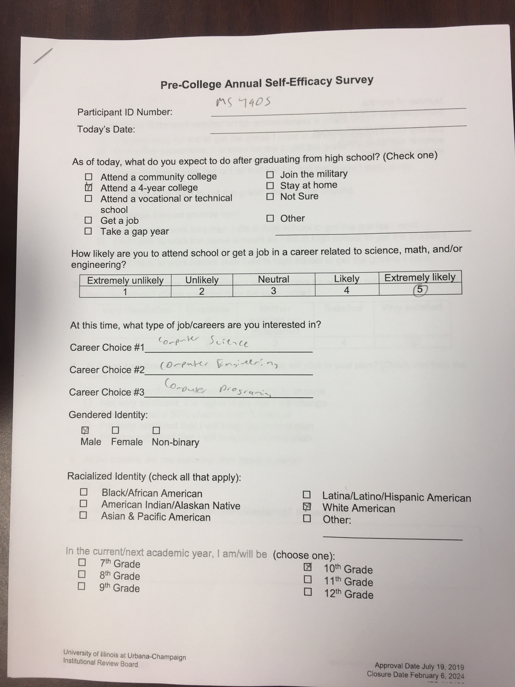

**The Mahomet-Seymour High School STEM Club provides opportunities for students to participate and lead STEM projects each meeting.** 

## **STEM Club Week 5 Additional Meeting**

# **STEM Club Survey**
Meeting leader - Dr. Lara Hebert 

Dr. Lara Hebert met with our students to have them complete a STEM club survey.  
The surveys will be used to improve STEM clubs in the state.

# **[Parent permission form for the survey](/documents/SurveyParentConsentForm.pdf)**                       
                                                                                                     
                                                                                                            
# **[Parent permission form for the survey](/documents/StemMinorAssent.pdf)**                         
                                                                                                            
                                                                                                        
# **[Parent permission form for the survey](/documents/StemSelfEfficacySurvey.pdf)**                      
                                                                                                 
                                                                                                           
                                                                                                           
                                                                    

