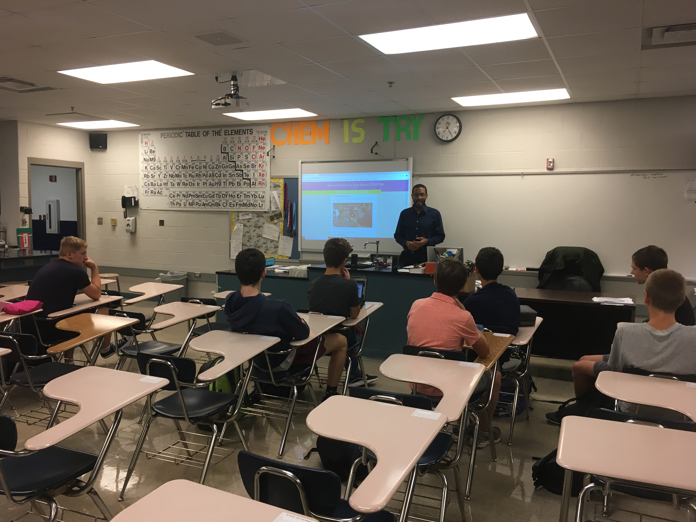
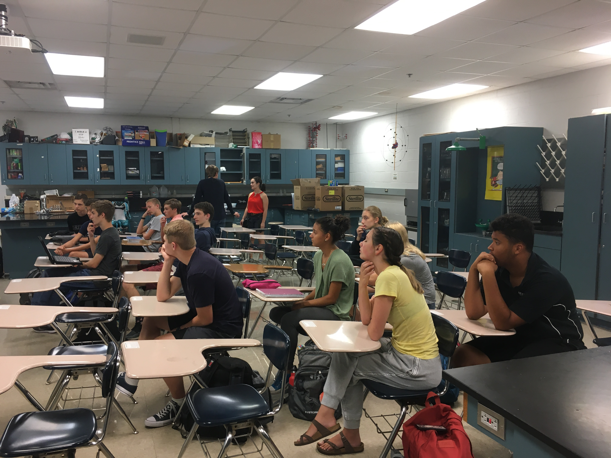
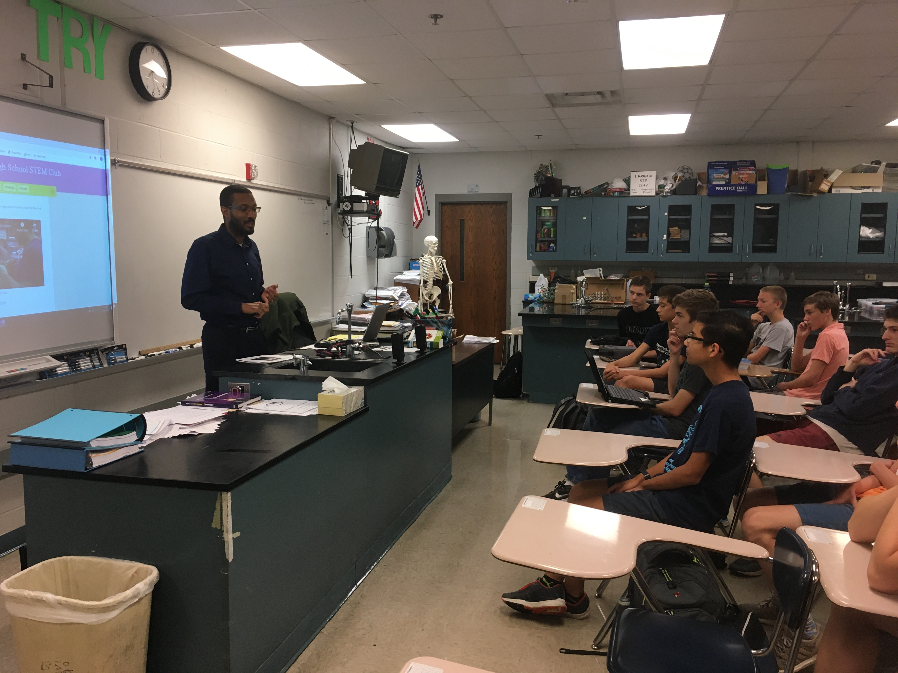
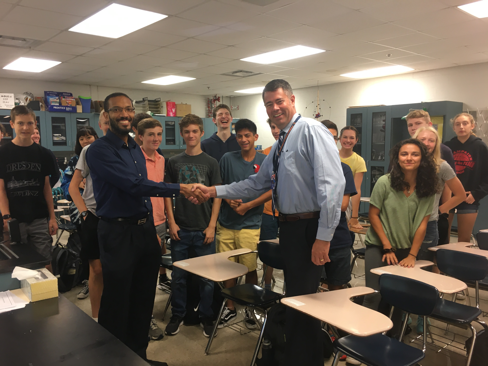
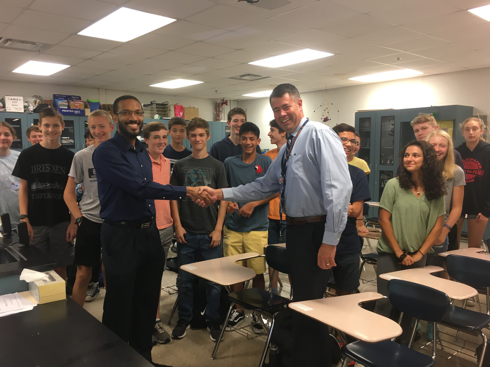
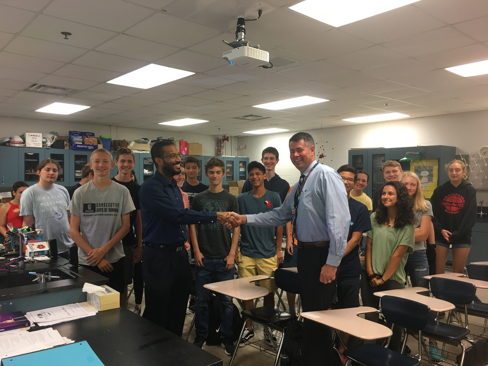
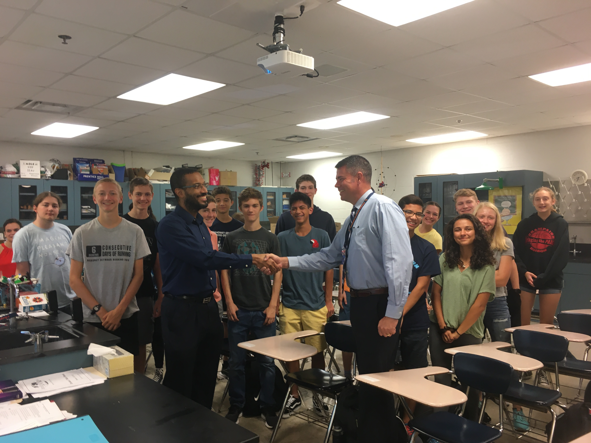

**The Mahomet-Seymour High School STEM Club provides opportunities for students to participate and lead STEM projects each meeting.** 

## **STEM Club Week 3 Additional Meeting**

# **Introduction into the STEM Club Grant**
Meeting leader - Dr. Lynford Goddard

# **Learning about the STEM Club grant from Dr. Lynford Goddard**

Dr. Lynford Goddard spent years of time and hard work to write a grant to get the funding needed to create STEM clubs and STEM camps for Illinois high school students.  He wrote a book with detailed STEM club experiments that we will be using for our projects.  He also provided our school STEM club kits with various activities for our club members to use.  He created a two week long training course for our sponsors to better equip them. Without his years of hard work our STEM club wouldn't have been created.

