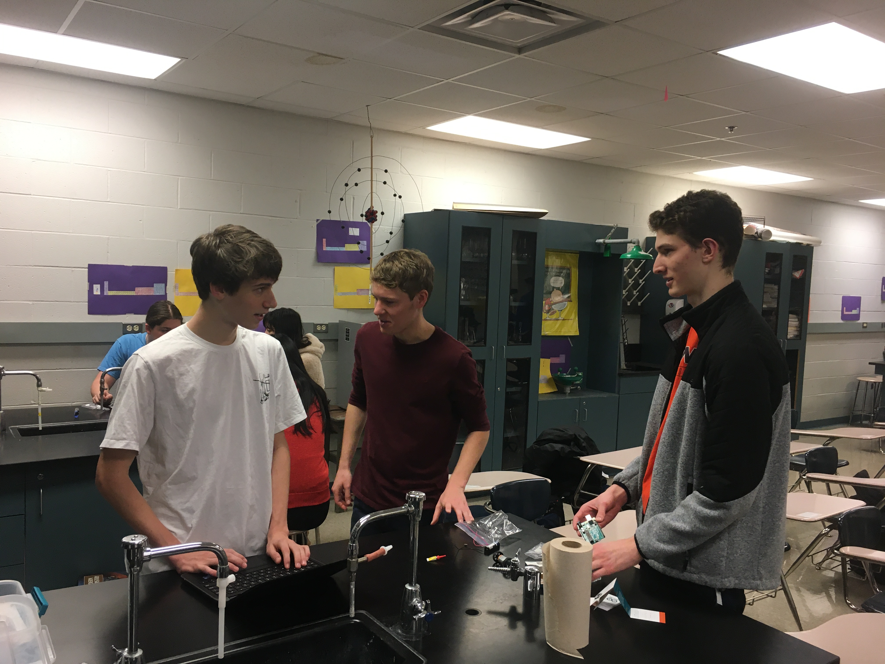

**The Mahomet-Seymour High School STEM Club provides opportunities for students to participate and lead STEM projects each meeting.** 

## **STEM Club Week 13 Project**

  

# **Motor Open Build Activity**

Project lead - Mr. Koker

                                                                                      

This project students worked divided into groups.  Each group was given some parts including a motor and battery.  
Each group was allowed to use various other parts they could find around the room to build "something".  This was a wide open 
project with no set objective.  Each group took a different direction with what they wanted to build.
                                                                                         

                                                                    

                                                                    

                                                                    

                                                                    

                                                                    

