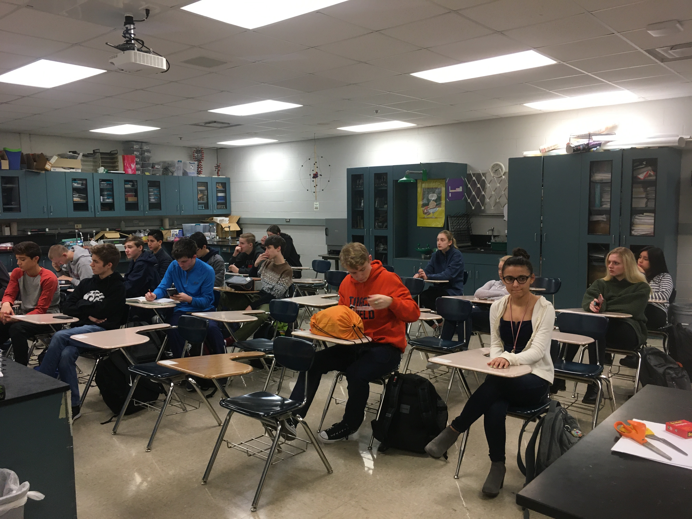

**The Mahomet-Seymour High School STEM Club provides opportunities for students to participate and lead STEM projects each meeting.** 

## **STEM Club Week 18 Project**

  

# **Paper Tower Build Activity**

Project lead - Mr. Koker

                                                                                      

This project students worked into groups of their choosing.  Each group was given some copy paper, sizzors, and tape.  
Each group was allowed to use the supplies given so they could build the tallest tower that could support the stuffed mole on top.  
Each group took a different direction with how they built their tower.
                                                                                         

                                                                    

                                                                    

                                                                    

                                                                    

                                                                    

                                                                    

                                                                    

                                                                    

                                                                    

                                                                    

                                                                    

                                                             

