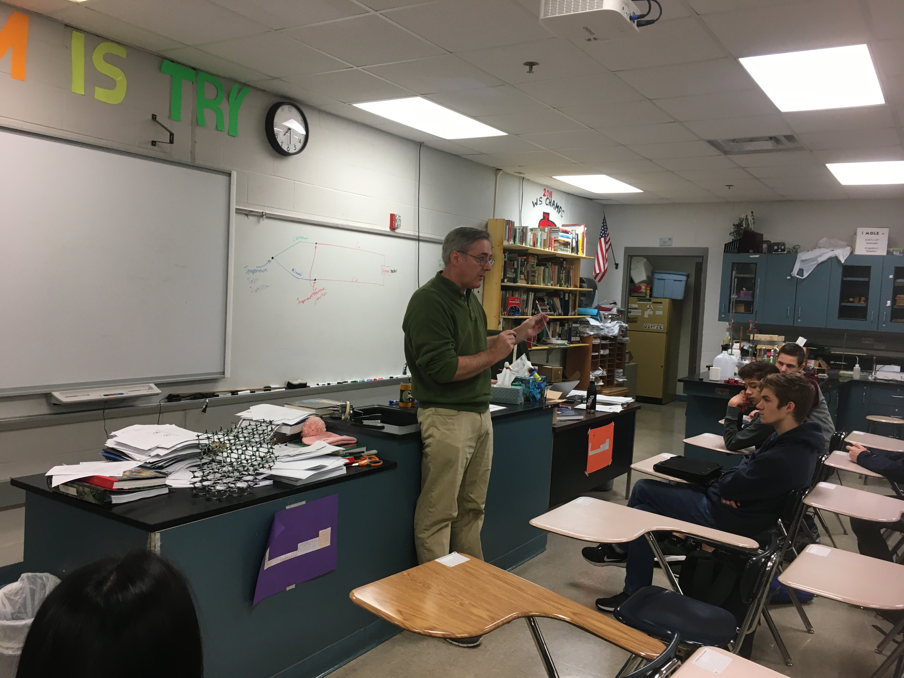
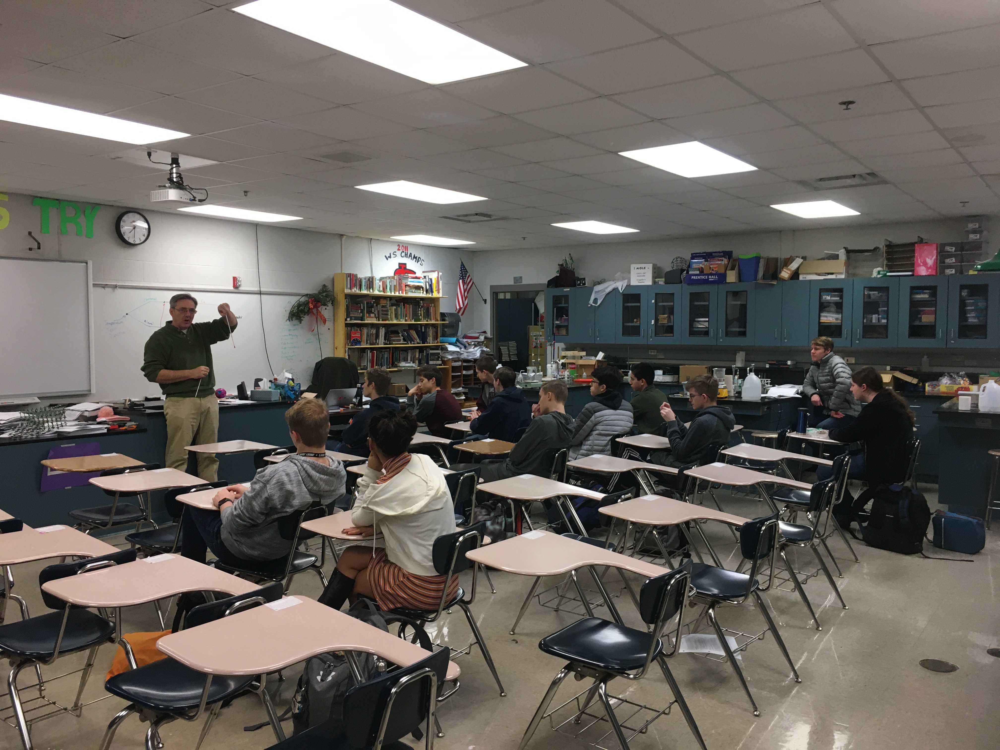
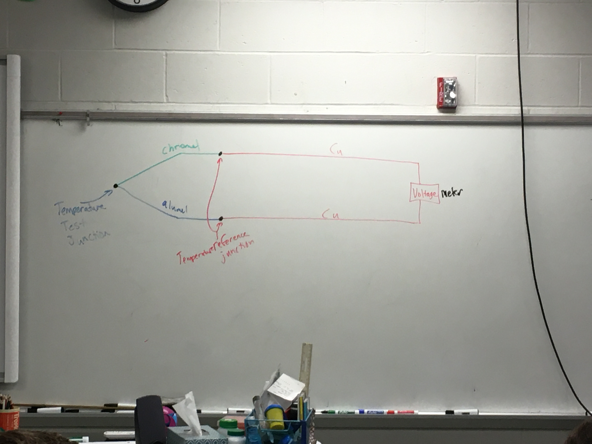
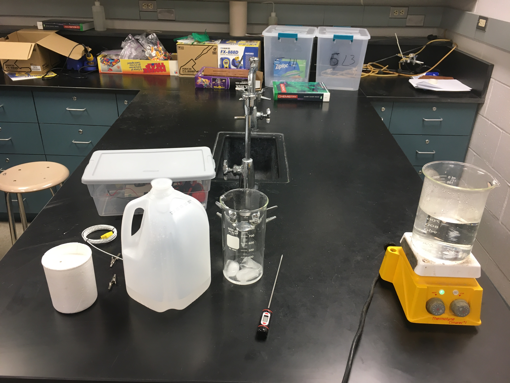
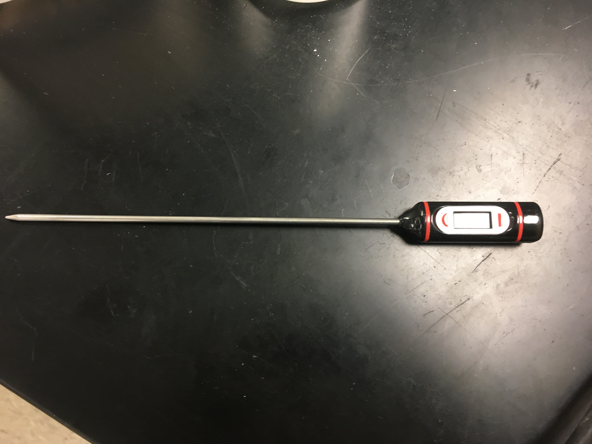
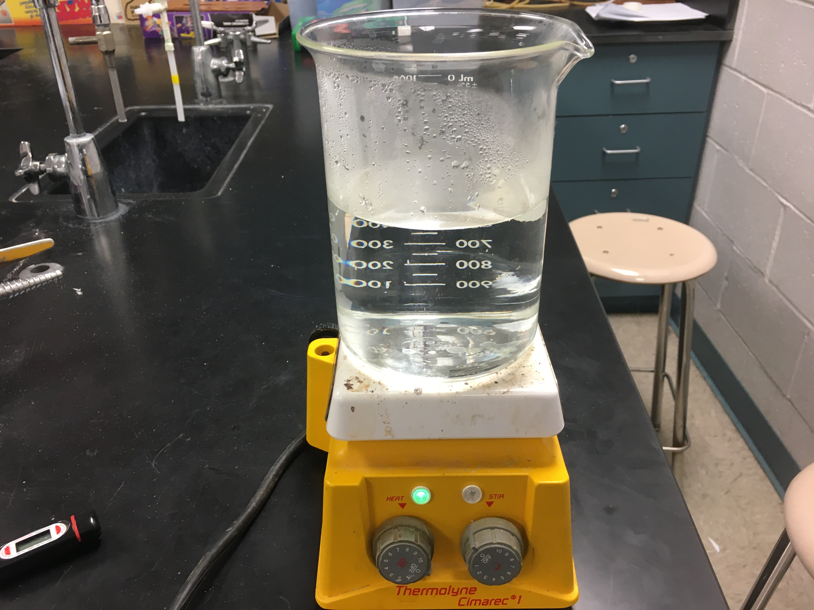
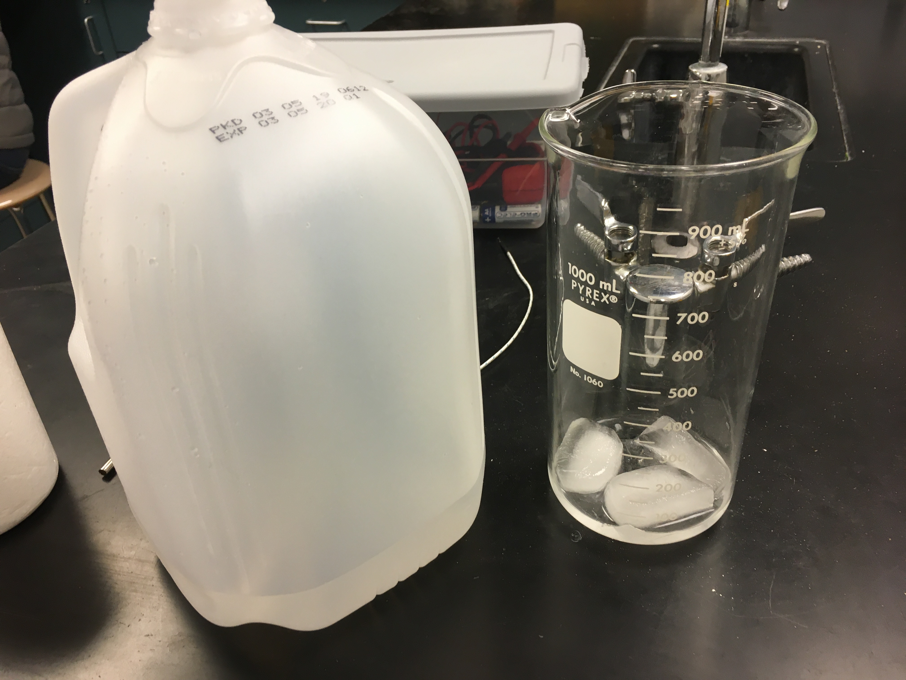

**The Mahomet-Seymour High School STEM Club provides opportunities for students to participate and lead STEM projects each meeting.** 

## **STEM Club Week 19 Project**

  

# **The relationship between Voltage and Temperature Activity**

Project lead - Mr. Koker

                                                                                      

This project students worked into groups of their choosing.  Each group was given various supplies to learn about the relationship of voltage and temperature.  
                                                                                         

                                                                    

                                                                    

                                                                    

