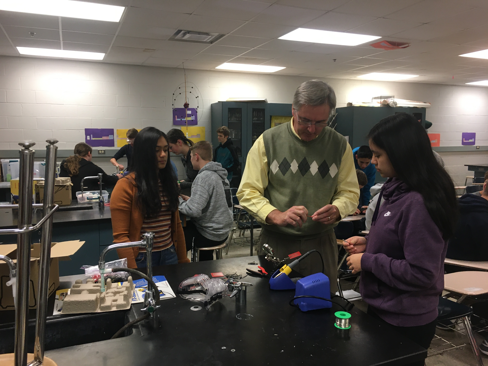
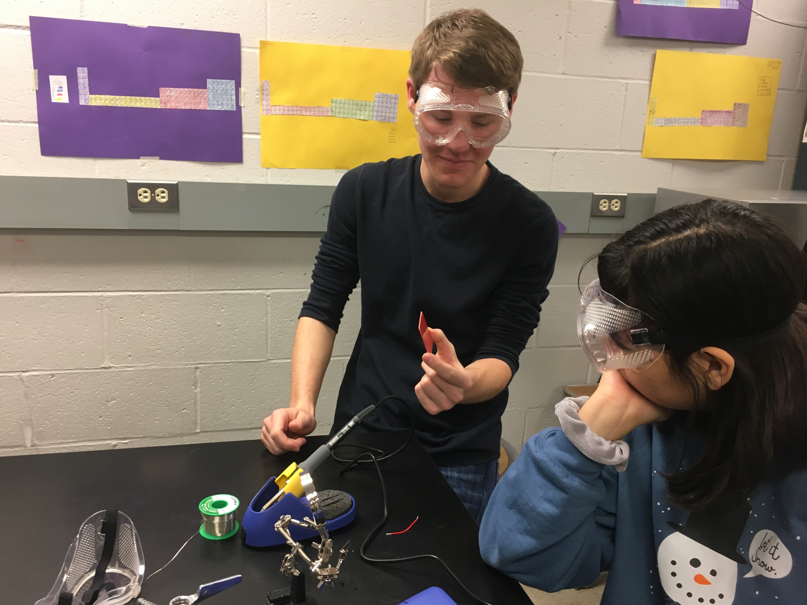
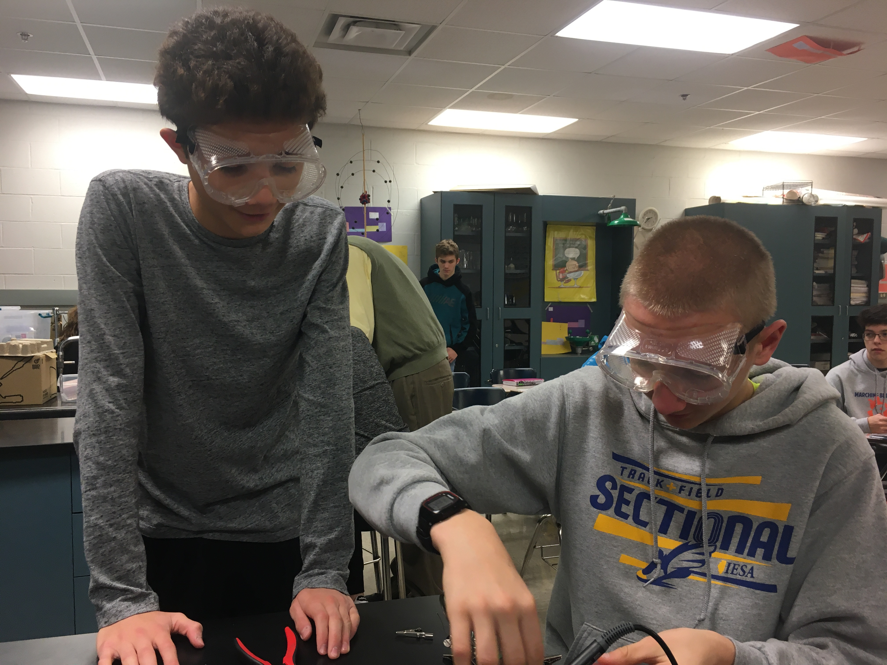
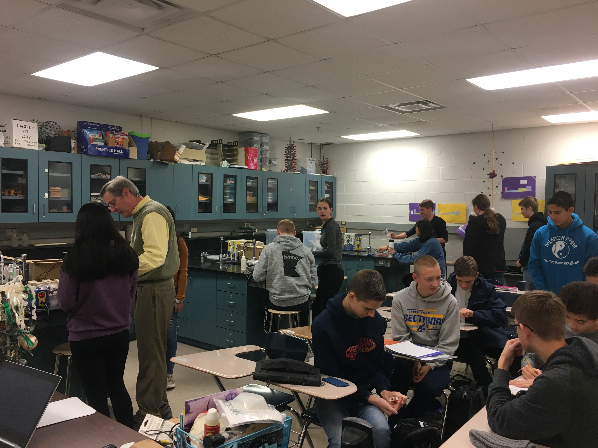
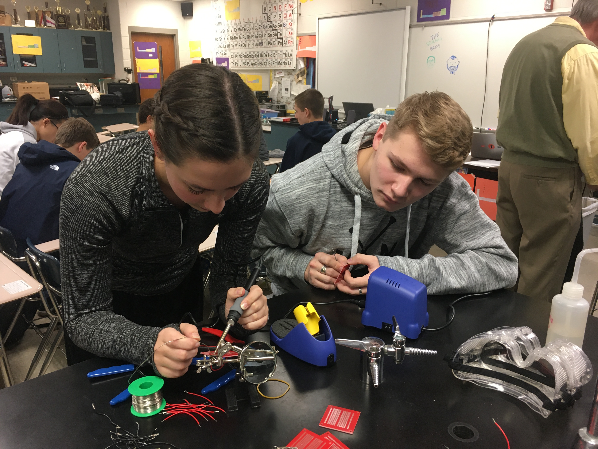

**The Mahomet-Seymour High School STEM Club provides opportunities for students to participate and lead STEM projects each meeting.** 

## **STEM Club Week 12 Project**

  

# **Soldering Day 2**

Project lead - Mr. Walmer

                                                                                      

This project students worked together and independently to continue to work on their soldering skills.  
                                                                                         

                                                                    

