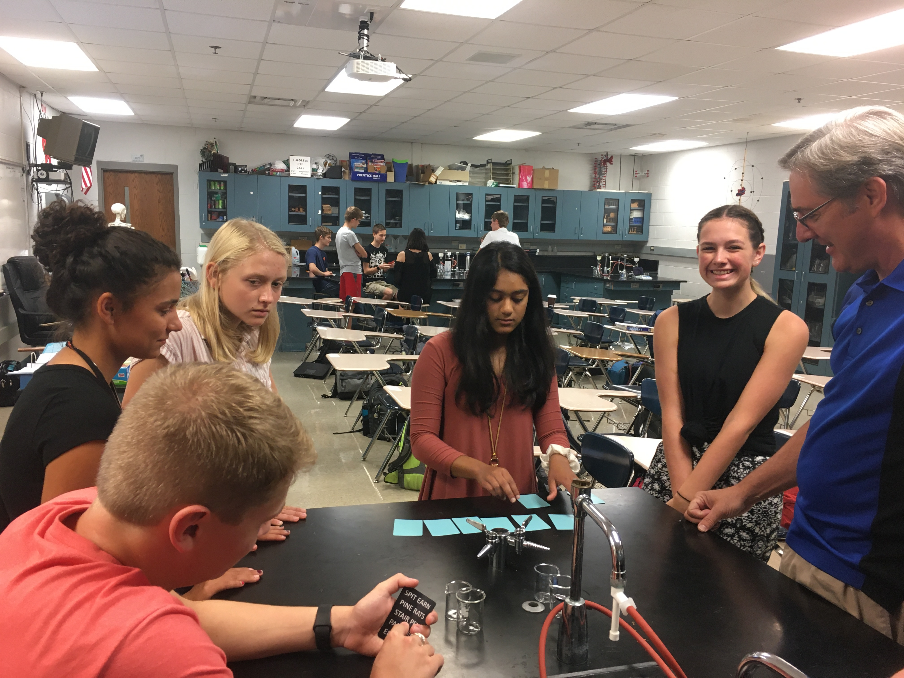

**STEM (Science, Technology, Engineering and Mathematics) Club**  
Our STEM Club is an informal, noncompetitive group of students and sponsors dedicated to exploring STEM. We do STEM hands on activities and learn about STEM careers. 

**Meet in Mr. Koker’s room (B20) on Mondays at 7:15 am to learn more!**

## **STEM Club Grant Video**
This is a short video about the STEM club grant that our high school received from the National Science Foundation.



This is information about the creation of the STEM Club.

### **[STEM Club Grant Project Article 1](https://ece.illinois.edu/newsroom/article/34060)**
                                                                                                                                                  
### **[STEM Club Grant Project Article 2](http://www.istem.illinois.edu/news/cisteme365.educators.html)**
                                                                                                                                          
### **[STEM Club Grant Project Article 3](http://www.istem.illinois.edu/news/cisteme365.html)**

  
                                     
                                                   
